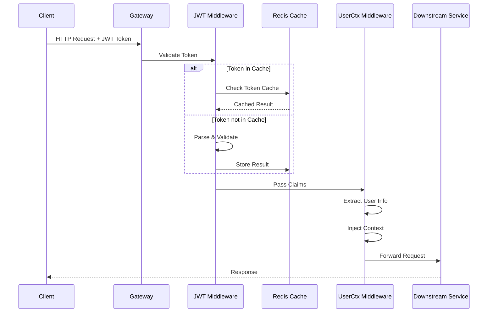

# NewBee 认证中间件集成指南

## 目录

1. [概述和架构说明](#1-概述和架构说明)
2. [JWT处理机制详解](#2-jwt处理机制详解)
3. [集成步骤和配置方法](#3-集成步骤和配置方法)
4. [用户上下文注入策略](#4-用户上下文注入策略)
5. [租户信息处理](#5-租户信息处理)
6. [性能优化配置](#6-性能优化配置)
7. [安全最佳实践](#7-安全最佳实践)
8. [缓存策略和配置](#8-缓存策略和配置)
9. [错误处理和调试](#9-错误处理和调试)
10. [代码示例和模板](#10-代码示例和模板)
11. [测试方法和验证](#11-测试方法和验证)
12. [故障排查指南](#12-故障排查指南)

---

## 1. 概述和架构说明

### 1.1 系统架构概览

NewBee认证中间件是一个高性能、多租户感知的JWT认证系统，设计用于微服务架构中的统一身份验证和授权。

```
┌─────────────────────────────────────────────────────────────┐
│                        API Gateway                          │
│                                                             │
│  ┌─────────────┐  ┌──────────────┐  ┌──────────────┐     │
│  │   Request   │→ │     JWT      │→ │   Context    │     │
│  │   Handler   │  │  Middleware  │  │   Injector   │     │
│  └─────────────┘  └──────────────┘  └──────────────┘     │
│         │                │                   │             │
│         ↓                ↓                   ↓             │
│  ┌─────────────────────────────────────────────────┐     │
│  │              Redis Cache Layer                   │     │
│  │  ┌──────────┐  ┌──────────┐  ┌──────────┐     │     │
│  │  │  Token   │  │   User   │  │  Tenant  │     │     │
│  │  │  Cache   │  │  Details │  │   Info   │     │     │
│  │  └──────────┘  └──────────┘  └──────────┘     │     │
│  └─────────────────────────────────────────────────┘     │
│                           │                                │
│                           ↓                                │
│                    Downstream Services                     │
└─────────────────────────────────────────────────────────────┘
```

### 1.2 核心组件说明

#### 1.2.1 JwtMiddleware
- **位置**: `/opt/code/newbee/common/middleware/jwmiddleware.go`
- **职责**: JWT令牌验证、解析和用户信息提取
- **特性**: 
  - 自动令牌验证
  - 声明解析和验证
  - 错误处理和响应
  - 性能优化的令牌缓存

#### 1.2.2 UserCtxMiddleware
- **位置**: `/opt/code/newbee/common/middleware/userctxmiddleware.go`
- **职责**: 用户上下文注入和请求追踪
- **特性**:
  - 用户信息注入到上下文
  - 租户ID自动提取
  - 请求追踪ID生成
  - 审计日志准备

#### 1.2.3 Redis缓存层
- **职责**: 高性能数据缓存
- **缓存内容**:
  - JWT令牌验证结果
  - 用户详细信息
  - 租户配置数据
  - 权限缓存

### 1.3 数据流程



---

## 2. JWT处理机制详解

### 2.1 令牌结构

```go
// JWT声明结构
type JwtClaims struct {
    jwt.RegisteredClaims
    BaseClaims
}

type BaseClaims struct {
    ID         uint64 `json:"id"`         // 用户ID
    Username   string `json:"username"`   // 用户名
    NickName   string `json:"nickName"`   // 昵称
    RoleId     string `json:"roleId"`     // 角色ID
    BufferTime int64  `json:"bufferTime"` // 缓冲时间
    TenantId   uint64 `json:"tenantId"`   // 租户ID
}
```

### 2.2 令牌验证流程

```go
// 令牌验证核心逻辑
func (m *JwtMiddleware) validateToken(token string) (*JwtClaims, error) {
    // 1. 检查缓存
    if cached := m.checkCache(token); cached != nil {
        return cached, nil
    }
    
    // 2. 解析令牌
    parsedToken, err := jwt.ParseWithClaims(
        token,
        &JwtClaims{},
        func(token *jwt.Token) (interface{}, error) {
            // 验证签名算法
            if _, ok := token.Method.(*jwt.SigningMethodHMAC); !ok {
                return nil, fmt.Errorf("unexpected signing method: %v", 
                    token.Header["alg"])
            }
            return []byte(m.config.AccessSecret), nil
        },
    )
    
    // 3. 验证声明
    if claims, ok := parsedToken.Claims.(*JwtClaims); ok && parsedToken.Valid {
        // 4. 缓存结果
        m.cacheToken(token, claims)
        return claims, nil
    }
    
    return nil, errors.New("invalid token")
}
```

### 2.3 令牌刷新机制

```go
// 自动令牌刷新逻辑
func (m *JwtMiddleware) autoRefreshToken(ctx context.Context, claims *JwtClaims) error {
    // 检查是否需要刷新
    if time.Now().Unix() > claims.ExpiresAt.Unix()-claims.BufferTime {
        // 生成新令牌
        newToken, err := m.generateNewToken(claims)
        if err != nil {
            return err
        }
        
        // 设置响应头
        httpx.SetHeader(ctx, "New-Token", newToken.AccessToken)
        httpx.SetHeader(ctx, "New-Expires-At", 
            strconv.FormatInt(newToken.ExpiresAt, 10))
        
        // 更新缓存
        m.updateTokenCache(newToken)
    }
    
    return nil
}
```

---

## 3. 集成步骤和配置方法

### 3.1 基础配置

#### 3.1.1 配置文件 (api-config.yaml)

```yaml
Name: user-api
Host: 0.0.0.0
Port: 8888

# JWT配置
Auth:
  AccessSecret: your-secret-key-min-32-chars-required-for-security
  AccessExpire: 86400  # 24小时
  BufferTime: 86400    # 缓冲时间

# Redis配置
RedisConf:
  Host: 127.0.0.1:6379
  Pass: your-redis-password
  DB: 0
  MaxRetries: 3
  PoolSize: 10
  MinIdleConns: 5

# 日志配置
LogConf:
  ServiceName: user-api
  Mode: file
  Path: logs
  Level: info
  Compress: false
  KeepDays: 7
  StackCooldownMillis: 100

# 性能配置
Performance:
  MaxConns: 10000
  MaxIdleConns: 100
  ConnMaxLifetime: 300
  RequestTimeout: 30
```

#### 3.1.2 RPC配置文件 (rpc-config.yaml)

```yaml
Name: user-rpc
ListenOn: 127.0.0.1:8080

# 数据库配置
DatabaseConf:
  Host: 127.0.0.1
  Port: 3306
  DBName: newbee_core
  Username: root
  Password: your-password
  SSLMode: disable
  MaxOpenConns: 100
  MaxIdleConns: 10
  ConnMaxLifetime: 3600

# Redis配置（与API保持一致）
RedisConf:
  Host: 127.0.0.1:6379
  Pass: your-redis-password
  DB: 0

# Etcd配置（服务发现）
Etcd:
  Hosts:
    - 127.0.0.1:2379
  Key: user.rpc
```

### 3.2 服务集成步骤

#### 步骤1: 导入依赖

```go
import (
    "github.com/coder-lulu/newbee-common/middleware"
    "github.com/coder-lulu/newbee-common/orm/ent/hooks"
    "github.com/zeromicro/go-zero/rest"
)
```

#### 步骤2: 初始化服务上下文

```go
// servicecontext.go
package svc

import (
    "github.com/coder-lulu/newbee-common/middleware"
    "github.com/coder-lulu/newbee-common/i18n"
    "github.com/zeromicro/go-zero/core/stores/redis"
    "github.com/zeromicro/go-zero/rest"
)

type ServiceContext struct {
    Config      config.Config
    Redis       *redis.Redis
    Authority   rest.Middleware
    TenantCheck rest.Middleware
    DataPerm    rest.Middleware
    UserRpc     userrpc.UserRpc
    Trans       *i18n.Translator
}

func NewServiceContext(c config.Config) *ServiceContext {
    // 初始化Redis
    rds := redis.MustNewRedis(redis.RedisConf{
        Host: c.RedisConf.Host,
        Pass: c.RedisConf.Pass,
        Type: c.RedisConf.Type,
    })
    
    // 初始化翻译器
    trans := i18n.NewTranslator(i18n.LocaleFS, i18n.LanguageZhCN)
    
    // 初始化RPC客户端
    userRpc := userrpc.NewUserRpc(zrpc.MustNewClient(c.UserRpcConf))
    
    return &ServiceContext{
        Config:      c,
        Redis:       rds,
        Authority:   middleware.NewAuthorityMiddleware(rds, userRpc).Handle,
        TenantCheck: middleware.NewTenantCheckMiddleware().Handle,
        DataPerm:    middleware.NewDataPermMiddleware(userRpc).Handle,
        UserRpc:     userRpc,
        Trans:       trans,
    }
}
```

#### 步骤3: 注册中间件

```go
// main.go
package main

import (
    "flag"
    "github.com/zeromicro/go-zero/core/conf"
    "github.com/zeromicro/go-zero/rest"
)

func main() {
    flag.Parse()
    
    var c config.Config
    conf.MustLoad(*configFile, &c)
    
    server := rest.MustNewServer(c.RestConf)
    defer server.Stop()
    
    ctx := svc.NewServiceContext(c)
    
    // 注册全局中间件
    server.Use(middleware.NewUserCtxMiddleware().Handle)
    
    // 注册路由
    handler.RegisterHandlers(server, ctx)
    
    server.Start()
}
```

#### 步骤4: API定义中使用中间件

```api
// user.api
syntax = "v1"

info(
    title: "用户管理API"
    desc: "用户管理相关接口"
    author: "NewBee Team"
    email: "admin@newbee.com"
    version: "v1.0"
)

// 需要认证的接口
@server(
    jwt: Auth
    group: user
    prefix: /api/v1/user
    middleware: Authority,TenantCheck,DataPerm  // 应用三层中间件
)
service user-api {
    @doc "获取用户列表"
    @handler getUserList
    get /list (GetUserListReq) returns (GetUserListResp)
    
    @doc "创建用户"
    @handler createUser
    post /create (CreateUserReq) returns (CreateUserResp)
}

// 公开接口（不需要认证）
@server(
    group: public
    prefix: /api/v1/public
)
service user-api {
    @doc "用户登录"
    @handler login
    post /login (LoginReq) returns (LoginResp)
    
    @doc "用户注册"
    @handler register
    post /register (RegisterReq) returns (RegisterResp)
}
```

---

## 4. 用户上下文注入策略

### 4.1 上下文键定义

```go
// context_keys.go
package ctxdata

type CtxKey string

const (
    // 用户相关
    CtxKeyUserId     CtxKey = "userId"
    CtxKeyUsername   CtxKey = "username"
    CtxKeyNickName   CtxKey = "nickName"
    CtxKeyRoleId     CtxKey = "roleId"
    
    // 租户相关
    CtxKeyTenantId   CtxKey = "tenantId"
    CtxKeyTenantName CtxKey = "tenantName"
    
    // 权限相关
    CtxKeyDataScope  CtxKey = "dataScope"
    CtxKeyDeptIds    CtxKey = "deptIds"
    
    // 追踪相关
    CtxKeyTraceId    CtxKey = "traceId"
    CtxKeySpanId     CtxKey = "spanId"
)
```

### 4.2 上下文注入实现

```go
// userctxmiddleware.go
package middleware

import (
    "context"
    "net/http"
    "github.com/zeromicro/go-zero/rest/httpx"
)

type UserCtxMiddleware struct {
    // 配置选项
    options UserCtxOptions
}

type UserCtxOptions struct {
    // 是否注入追踪信息
    EnableTracing bool
    // 是否注入扩展信息
    EnableExtended bool
    // 自定义注入函数
    CustomInjectors []ContextInjector
}

type ContextInjector func(ctx context.Context, r *http.Request) context.Context

func (m *UserCtxMiddleware) Handle(next http.HandlerFunc) http.HandlerFunc {
    return func(w http.ResponseWriter, r *http.Request) {
        ctx := r.Context()
        
        // 1. 从JWT声明中提取用户信息
        if claims := m.extractClaims(ctx); claims != nil {
            // 基础用户信息
            ctx = context.WithValue(ctx, CtxKeyUserId, claims.ID)
            ctx = context.WithValue(ctx, CtxKeyUsername, claims.Username)
            ctx = context.WithValue(ctx, CtxKeyNickName, claims.NickName)
            ctx = context.WithValue(ctx, CtxKeyRoleId, claims.RoleId)
            ctx = context.WithValue(ctx, CtxKeyTenantId, claims.TenantId)
        }
        
        // 2. 注入追踪信息
        if m.options.EnableTracing {
            ctx = m.injectTracingInfo(ctx, r)
        }
        
        // 3. 注入扩展信息
        if m.options.EnableExtended {
            ctx = m.injectExtendedInfo(ctx, r)
        }
        
        // 4. 执行自定义注入器
        for _, injector := range m.options.CustomInjectors {
            ctx = injector(ctx, r)
        }
        
        // 5. 传递到下一个处理器
        next(w, r.WithContext(ctx))
    }
}

// 注入追踪信息
func (m *UserCtxMiddleware) injectTracingInfo(ctx context.Context, r *http.Request) context.Context {
    traceId := r.Header.Get("X-Trace-Id")
    if traceId == "" {
        traceId = generateTraceId()
    }
    
    spanId := generateSpanId()
    
    ctx = context.WithValue(ctx, CtxKeyTraceId, traceId)
    ctx = context.WithValue(ctx, CtxKeySpanId, spanId)
    
    return ctx
}

// 注入扩展信息（如客户端信息）
func (m *UserCtxMiddleware) injectExtendedInfo(ctx context.Context, r *http.Request) context.Context {
    ctx = context.WithValue(ctx, "clientIp", getClientIP(r))
    ctx = context.WithValue(ctx, "userAgent", r.UserAgent())
    ctx = context.WithValue(ctx, "requestId", r.Header.Get("X-Request-Id"))
    
    return ctx
}
```

### 4.3 使用上下文信息

```go
// 在业务逻辑中使用
func (l *GetUserListLogic) GetUserList(req *types.GetUserListReq) (*types.GetUserListResp, error) {
    // 获取用户ID
    userId := ctxdata.GetUserIdFromCtx(l.ctx)
    
    // 获取租户ID
    tenantId := ctxdata.GetTenantIdFromCtx(l.ctx)
    
    // 获取追踪ID
    traceId := ctxdata.GetTraceIdFromCtx(l.ctx)
    
    l.Logger.Infof("User %d from tenant %d requesting user list, trace: %s", 
        userId, tenantId, traceId)
    
    // 业务逻辑...
    users, err := l.svcCtx.UserRpc.GetUserList(l.ctx, &user.GetUserListReq{
        PageNum:  req.PageNum,
        PageSize: req.PageSize,
    })
    
    return &types.GetUserListResp{
        List:  users.List,
        Total: users.Total,
    }, nil
}
```

---

## 5. 租户信息处理

### 5.1 租户中间件实现

```go
// tenantcheckmiddleware.go
package middleware

import (
    "context"
    "net/http"
    "github.com/pkg/errors"
)

type TenantCheckMiddleware struct {
    // 租户验证器
    validator TenantValidator
    // 缓存
    cache *redis.Redis
}

type TenantValidator interface {
    Validate(ctx context.Context, tenantId uint64) error
    GetTenantInfo(ctx context.Context, tenantId uint64) (*TenantInfo, error)
}

func (m *TenantCheckMiddleware) Handle(next http.HandlerFunc) http.HandlerFunc {
    return func(w http.ResponseWriter, r *http.Request) {
        ctx := r.Context()
        
        // 1. 提取租户ID
        tenantId := m.extractTenantId(ctx)
        if tenantId == 0 {
            httpx.ErrorCtx(ctx, w, errors.New("missing tenant information"))
            return
        }
        
        // 2. 验证租户状态
        if err := m.validateTenant(ctx, tenantId); err != nil {
            httpx.ErrorCtx(ctx, w, errors.Wrapf(err, "invalid tenant: %d", tenantId))
            return
        }
        
        // 3. 加载租户配置
        tenantInfo, err := m.loadTenantInfo(ctx, tenantId)
        if err != nil {
            httpx.ErrorCtx(ctx, w, errors.Wrap(err, "failed to load tenant info"))
            return
        }
        
        // 4. 注入租户信息到上下文
        ctx = m.injectTenantInfo(ctx, tenantInfo)
        
        // 5. 设置租户响应头
        w.Header().Set("X-Tenant-Id", strconv.FormatUint(tenantId, 10))
        
        next(w, r.WithContext(ctx))
    }
}

// 验证租户
func (m *TenantCheckMiddleware) validateTenant(ctx context.Context, tenantId uint64) error {
    // 检查缓存
    cacheKey := fmt.Sprintf("tenant:status:%d", tenantId)
    if status, err := m.cache.Get(cacheKey); err == nil && status == "active" {
        return nil
    }
    
    // 验证租户
    if err := m.validator.Validate(ctx, tenantId); err != nil {
        return err
    }
    
    // 更新缓存
    m.cache.SetexCtx(ctx, cacheKey, "active", 300) // 5分钟缓存
    
    return nil
}

// 加载租户信息
func (m *TenantCheckMiddleware) loadTenantInfo(ctx context.Context, tenantId uint64) (*TenantInfo, error) {
    cacheKey := fmt.Sprintf("tenant:info:%d", tenantId)
    
    // 尝试从缓存加载
    var info TenantInfo
    if err := m.cache.GetCtx(ctx, cacheKey, &info); err == nil {
        return &info, nil
    }
    
    // 从数据库加载
    info, err := m.validator.GetTenantInfo(ctx, tenantId)
    if err != nil {
        return nil, err
    }
    
    // 缓存租户信息
    m.cache.SetexCtx(ctx, cacheKey, info, 600) // 10分钟缓存
    
    return info, nil
}
```

### 5.2 租户隔离实现

```go
// 在RPC服务中的租户隔离
package logic

import (
    "github.com/coder-lulu/newbee-common/orm/ent/hooks"
)

func (l *GetUserListLogic) GetUserList(in *user.GetUserListReq) (*user.GetUserListResp, error) {
    // 自动应用租户过滤（通过Hook机制）
    users, err := l.svcCtx.DB.User.
        Query().
        Where(
            user.StatusEQ(1),
        ).
        Limit(int(in.PageSize)).
        Offset(int((in.PageNum - 1) * in.PageSize)).
        All(l.ctx) // 上下文中包含租户ID，Hook自动应用过滤
    
    if err != nil {
        return nil, err
    }
    
    // 统计总数（同样自动应用租户过滤）
    total, err := l.svcCtx.DB.User.
        Query().
        Where(user.StatusEQ(1)).
        Count(l.ctx)
    
    return &user.GetUserListResp{
        List:  convertUsers(users),
        Total: int64(total),
    }, nil
}
```

### 5.3 跨租户操作（系统级）

```go
// 系统级操作（绕过租户限制）
func (l *SystemMaintenanceLogic) CleanupInactiveTenants() error {
    // 使用系统上下文
    systemCtx := hooks.NewSystemContext(context.Background())
    
    // 查找所有不活跃的租户
    inactiveTenants, err := l.svcCtx.DB.Tenant.
        Query().
        Where(
            tenant.StatusEQ(0),
            tenant.UpdateTimeLT(time.Now().AddDate(0, -3, 0)), // 3个月未更新
        ).
        All(systemCtx) // 使用系统上下文，可以访问所有租户
    
    // 清理操作
    for _, t := range inactiveTenants {
        if err := l.cleanupTenant(systemCtx, t); err != nil {
            l.Logger.Errorf("Failed to cleanup tenant %d: %v", t.ID, err)
        }
    }
    
    return nil
}
```

---

## 6. 性能优化配置

### 6.1 连接池优化

```go
// 数据库连接池配置
type DatabaseConfig struct {
    // 最大连接数
    MaxOpenConns int `json:",default=100"`
    // 最大空闲连接数
    MaxIdleConns int `json:",default=10"`
    // 连接最大生命周期（秒）
    ConnMaxLifetime int `json:",default=3600"`
    // 连接最大空闲时间（秒）
    ConnMaxIdleTime int `json:",default=1800"`
}

// Redis连接池配置
type RedisConfig struct {
    // 连接池大小
    PoolSize int `json:",default=10"`
    // 最小空闲连接数
    MinIdleConns int `json:",default=5"`
    // 连接最大生命周期
    MaxConnAge time.Duration `json:",default=0"`
    // 空闲超时时间
    IdleTimeout time.Duration `json:",default=5m"`
    // 连接超时时间
    DialTimeout time.Duration `json:",default=5s"`
    // 读超时时间
    ReadTimeout time.Duration `json:",default=3s"`
    // 写超时时间
    WriteTimeout time.Duration `json:",default=3s"`
}
```

### 6.2 缓存策略优化

```go
// 多级缓存实现
package cache

import (
    "github.com/patrickmn/go-cache"
    "github.com/zeromicro/go-zero/core/stores/redis"
)

type MultiLevelCache struct {
    // L1: 本地内存缓存
    localCache *cache.Cache
    // L2: Redis缓存
    redisCache *redis.Redis
    // 配置
    config CacheConfig
}

type CacheConfig struct {
    // 本地缓存配置
    LocalCacheSize    int           `json:",default=1000"`
    LocalCacheTTL     time.Duration `json:",default=60s"`
    
    // Redis缓存配置
    RedisCacheTTL     time.Duration `json:",default=300s"`
    
    // 预热配置
    WarmupOnStart     bool          `json:",default=true"`
    WarmupBatchSize   int           `json:",default=100"`
}

func (c *MultiLevelCache) Get(key string) (interface{}, error) {
    // 1. 尝试从L1获取
    if val, found := c.localCache.Get(key); found {
        return val, nil
    }
    
    // 2. 尝试从L2获取
    var val interface{}
    if err := c.redisCache.GetCtx(context.Background(), key, &val); err == nil {
        // 回填L1
        c.localCache.Set(key, val, c.config.LocalCacheTTL)
        return val, nil
    }
    
    return nil, ErrCacheMiss
}

func (c *MultiLevelCache) Set(key string, value interface{}) error {
    // 同时写入L1和L2
    c.localCache.Set(key, value, c.config.LocalCacheTTL)
    return c.redisCache.SetexCtx(context.Background(), key, value, 
        int(c.config.RedisCacheTTL.Seconds()))
}
```

### 6.3 并发控制优化

```go
// 并发限流器
package ratelimit

import (
    "golang.org/x/time/rate"
    "sync"
)

type TenantRateLimiter struct {
    limiters map[uint64]*rate.Limiter
    mu       sync.RWMutex
    // 默认配置
    defaultRate  rate.Limit
    defaultBurst int
}

func (l *TenantRateLimiter) Allow(tenantId uint64) bool {
    limiter := l.getLimiter(tenantId)
    return limiter.Allow()
}

func (l *TenantRateLimiter) getLimiter(tenantId uint64) *rate.Limiter {
    l.mu.RLock()
    limiter, exists := l.limiters[tenantId]
    l.mu.RUnlock()
    
    if exists {
        return limiter
    }
    
    // 创建新的限流器
    l.mu.Lock()
    defer l.mu.Unlock()
    
    // 双重检查
    if limiter, exists := l.limiters[tenantId]; exists {
        return limiter
    }
    
    limiter = rate.NewLimiter(l.defaultRate, l.defaultBurst)
    l.limiters[tenantId] = limiter
    
    return limiter
}
```

### 6.4 批处理优化

```go
// 批量操作优化
package batch

import (
    "sync"
    "time"
)

type BatchProcessor struct {
    batchSize    int
    flushInterval time.Duration
    processor    func(items []interface{}) error
    
    items        []interface{}
    mu           sync.Mutex
    timer        *time.Timer
}

func (p *BatchProcessor) Add(item interface{}) {
    p.mu.Lock()
    defer p.mu.Unlock()
    
    p.items = append(p.items, item)
    
    // 达到批量大小，立即处理
    if len(p.items) >= p.batchSize {
        p.flush()
        return
    }
    
    // 启动定时器
    if p.timer == nil {
        p.timer = time.AfterFunc(p.flushInterval, func() {
            p.mu.Lock()
            defer p.mu.Unlock()
            p.flush()
        })
    }
}

func (p *BatchProcessor) flush() {
    if len(p.items) == 0 {
        return
    }
    
    // 处理批量数据
    go p.processor(p.items)
    
    // 重置
    p.items = nil
    if p.timer != nil {
        p.timer.Stop()
        p.timer = nil
    }
}
```

---

## 7. 安全最佳实践

### 7.1 JWT安全配置

```go
// JWT安全配置
type JWTSecurityConfig struct {
    // 密钥管理
    AccessSecret     string        `json:",env=JWT_SECRET"`     // 从环境变量读取
    SecretRotation   bool          `json:",default=true"`        // 启用密钥轮换
    RotationInterval time.Duration `json:",default=720h"`        // 30天轮换一次
    
    // 令牌配置
    AccessExpire     time.Duration `json:",default=2h"`          // 访问令牌有效期
    RefreshExpire    time.Duration `json:",default=168h"`        // 刷新令牌有效期
    
    // 安全选项
    RequireAudience  bool          `json:",default=true"`        // 要求受众验证
    RequireIssuer    bool          `json:",default=true"`        // 要求发行者验证
    AllowedIssuers   []string      `json:",optional"`            // 允许的发行者列表
    
    // 黑名单
    EnableBlacklist  bool          `json:",default=true"`        // 启用令牌黑名单
    BlacklistTTL     time.Duration `json:",default=24h"`         // 黑名单保留时间
}

// 密钥轮换实现
func (s *SecurityService) RotateJWTSecret() error {
    // 生成新密钥
    newSecret := generateSecureSecret(64)
    
    // 保存旧密钥用于验证
    oldSecret := s.config.AccessSecret
    s.oldSecrets = append(s.oldSecrets, oldSecret)
    
    // 更新当前密钥
    s.config.AccessSecret = newSecret
    
    // 通知所有服务
    return s.notifySecretRotation(newSecret)
}
```

### 7.2 请求签名验证

```go
// 请求签名中间件
type SignatureMiddleware struct {
    secretKey []byte
    timeout   time.Duration
}

func (m *SignatureMiddleware) Handle(next http.HandlerFunc) http.HandlerFunc {
    return func(w http.ResponseWriter, r *http.Request) {
        // 获取签名参数
        timestamp := r.Header.Get("X-Timestamp")
        nonce := r.Header.Get("X-Nonce")
        signature := r.Header.Get("X-Signature")
        
        // 验证时间戳
        if err := m.validateTimestamp(timestamp); err != nil {
            httpx.Error(w, err)
            return
        }
        
        // 验证随机数（防重放）
        if err := m.validateNonce(nonce); err != nil {
            httpx.Error(w, err)
            return
        }
        
        // 验证签名
        expectedSig := m.calculateSignature(r, timestamp, nonce)
        if !hmac.Equal([]byte(signature), []byte(expectedSig)) {
            httpx.Error(w, errors.New("invalid signature"))
            return
        }
        
        next(w, r)
    }
}

func (m *SignatureMiddleware) calculateSignature(r *http.Request, timestamp, nonce string) string {
    // 构建签名字符串
    signStr := fmt.Sprintf("%s\n%s\n%s\n%s", 
        r.Method,
        r.URL.Path,
        timestamp,
        nonce,
    )
    
    // 如果有请求体，包含请求体的哈希
    if r.Body != nil {
        body, _ := ioutil.ReadAll(r.Body)
        r.Body = ioutil.NopCloser(bytes.NewBuffer(body))
        
        bodyHash := sha256.Sum256(body)
        signStr += "\n" + hex.EncodeToString(bodyHash[:])
    }
    
    // 计算HMAC
    h := hmac.New(sha256.New, m.secretKey)
    h.Write([]byte(signStr))
    return hex.EncodeToString(h.Sum(nil))
}
```

### 7.3 SQL注入防护

```go
// 参数验证器
type ParamValidator struct {
    rules map[string]ValidationRule
}

type ValidationRule struct {
    Type       string   // string, int, email, phone, etc.
    Required   bool
    MinLength  int
    MaxLength  int
    Pattern    string   // 正则表达式
    Sanitize   bool     // 是否清理输入
}

func (v *ParamValidator) Validate(params map[string]interface{}) error {
    for key, value := range params {
        rule, exists := v.rules[key]
        if !exists && v.strictMode {
            return fmt.Errorf("unexpected parameter: %s", key)
        }
        
        if exists {
            if err := v.validateParam(key, value, rule); err != nil {
                return err
            }
        }
    }
    
    return nil
}

func (v *ParamValidator) validateParam(key string, value interface{}, rule ValidationRule) error {
    // 类型检查
    if !v.checkType(value, rule.Type) {
        return fmt.Errorf("invalid type for %s", key)
    }
    
    // 长度检查
    if str, ok := value.(string); ok {
        if len(str) < rule.MinLength || len(str) > rule.MaxLength {
            return fmt.Errorf("invalid length for %s", key)
        }
        
        // 模式匹配
        if rule.Pattern != "" {
            matched, _ := regexp.MatchString(rule.Pattern, str)
            if !matched {
                return fmt.Errorf("invalid format for %s", key)
            }
        }
        
        // SQL注入检测
        if v.containsSQLInjection(str) {
            return fmt.Errorf("potential SQL injection in %s", key)
        }
    }
    
    return nil
}

func (v *ParamValidator) containsSQLInjection(input string) bool {
    // SQL注入模式
    patterns := []string{
        `(?i)(union|select|insert|update|delete|drop|create|alter|exec|execute|script|javascript)`,
        `(?i)(--|#|\/\*|\*\/|xp_|sp_|0x)`,
        `(?i)(having|group\s+by|order\s+by)`,
        `(?i)(waitfor\s+delay|benchmark|sleep)`,
    }
    
    for _, pattern := range patterns {
        if matched, _ := regexp.MatchString(pattern, input); matched {
            return true
        }
    }
    
    return false
}
```

### 7.4 XSS防护

```go
// XSS防护中间件
package security

import (
    "github.com/microcosm-cc/bluemonday"
)

type XSSProtection struct {
    policy *bluemonday.Policy
}

func NewXSSProtection() *XSSProtection {
    // 创建严格的HTML清理策略
    policy := bluemonday.StrictPolicy()
    
    return &XSSProtection{
        policy: policy,
    }
}

func (x *XSSProtection) SanitizeString(input string) string {
    return x.policy.Sanitize(input)
}

func (x *XSSProtection) SanitizeMap(data map[string]interface{}) map[string]interface{} {
    sanitized := make(map[string]interface{})
    
    for key, value := range data {
        switch v := value.(type) {
        case string:
            sanitized[key] = x.SanitizeString(v)
        case map[string]interface{}:
            sanitized[key] = x.SanitizeMap(v)
        default:
            sanitized[key] = value
        }
    }
    
    return sanitized
}
```

### 7.5 审计日志

```go
// 审计日志中间件
type AuditMiddleware struct {
    logger AuditLogger
}

type AuditLog struct {
    // 基础信息
    Timestamp   time.Time `json:"timestamp"`
    TraceId     string    `json:"trace_id"`
    
    // 用户信息
    UserId      uint64    `json:"user_id"`
    Username    string    `json:"username"`
    TenantId    uint64    `json:"tenant_id"`
    
    // 请求信息
    Method      string    `json:"method"`
    Path        string    `json:"path"`
    IP          string    `json:"ip"`
    UserAgent   string    `json:"user_agent"`
    
    // 响应信息
    StatusCode  int       `json:"status_code"`
    Duration    int64     `json:"duration_ms"`
    
    // 安全信息
    Action      string    `json:"action"`      // CREATE, UPDATE, DELETE, READ
    Resource    string    `json:"resource"`    // 资源类型
    ResourceId  string    `json:"resource_id"` // 资源ID
    Result      string    `json:"result"`      // SUCCESS, FAILURE
    ErrorMsg    string    `json:"error_msg,omitempty"`
}

func (m *AuditMiddleware) Handle(next http.HandlerFunc) http.HandlerFunc {
    return func(w http.ResponseWriter, r *http.Request) {
        start := time.Now()
        
        // 创建审计日志
        audit := &AuditLog{
            Timestamp: start,
            TraceId:   getTraceId(r.Context()),
            UserId:    getUserId(r.Context()),
            Username:  getUsername(r.Context()),
            TenantId:  getTenantId(r.Context()),
            Method:    r.Method,
            Path:      r.URL.Path,
            IP:        getClientIP(r),
            UserAgent: r.UserAgent(),
        }
        
        // 包装ResponseWriter以捕获状态码
        wrapped := &responseWriter{ResponseWriter: w}
        
        // 执行请求
        next(wrapped, r)
        
        // 完成审计日志
        audit.StatusCode = wrapped.statusCode
        audit.Duration = time.Since(start).Milliseconds()
        audit.Result = m.determineResult(wrapped.statusCode)
        
        // 异步写入审计日志
        go m.logger.Log(audit)
    }
}
```

---

## 8. 缓存策略和配置

### 8.1 缓存架构

```go
// 缓存层次结构
type CacheLayer struct {
    // L1: 进程内缓存（最快）
    ProcessCache *ProcessCache
    
    // L2: Redis本地缓存（快）
    LocalRedis *redis.Redis
    
    // L3: Redis集群缓存（分布式）
    ClusterRedis *redis.RedisCluster
    
    // 配置
    config CacheConfig
}

type CacheConfig struct {
    // 缓存策略
    Strategy        string        `json:",default=lru"`     // lru, lfu, ttl
    
    // L1配置
    L1Enabled       bool          `json:",default=true"`
    L1Size          int           `json:",default=10000"`
    L1TTL           time.Duration `json:",default=60s"`
    
    // L2配置
    L2Enabled       bool          `json:",default=true"`
    L2TTL           time.Duration `json:",default=300s"`
    
    // L3配置
    L3Enabled       bool          `json:",default=true"`
    L3TTL           time.Duration `json:",default=3600s"`
    
    // 预热配置
    WarmupEnabled   bool          `json:",default=true"`
    WarmupKeys      []string      `json:",optional"`
}
```

### 8.2 缓存键设计

```go
// 缓存键生成器
type CacheKeyBuilder struct {
    prefix    string
    separator string
}

func NewCacheKeyBuilder(prefix string) *CacheKeyBuilder {
    return &CacheKeyBuilder{
        prefix:    prefix,
        separator: ":",
    }
}

// 用户信息缓存键
func (b *CacheKeyBuilder) UserInfo(tenantId, userId uint64) string {
    return fmt.Sprintf("%s%suser%sinfo%s%d%s%d", 
        b.prefix, b.separator, b.separator, b.separator, tenantId, b.separator, userId)
}

// 权限缓存键
func (b *CacheKeyBuilder) Permission(tenantId, roleId uint64) string {
    return fmt.Sprintf("%s%sperm%s%d%s%d",
        b.prefix, b.separator, b.separator, tenantId, b.separator, roleId)
}

// 令牌缓存键
func (b *CacheKeyBuilder) Token(tokenId string) string {
    return fmt.Sprintf("%s%stoken%s%s",
        b.prefix, b.separator, b.separator, tokenId)
}

// 使用示例
keyBuilder := NewCacheKeyBuilder("newbee")
userKey := keyBuilder.UserInfo(tenantId, userId) // newbee:user:info:1:1001
```

### 8.3 缓存更新策略

```go
// 缓存更新器
type CacheUpdater struct {
    cache  CacheLayer
    loader DataLoader
}

type DataLoader interface {
    LoadUserInfo(ctx context.Context, userId uint64) (*UserInfo, error)
    LoadPermissions(ctx context.Context, roleId uint64) ([]string, error)
}

// Cache-Aside模式
func (u *CacheUpdater) GetUserInfo(ctx context.Context, userId uint64) (*UserInfo, error) {
    key := u.buildKey("user", userId)
    
    // 1. 尝试从缓存获取
    if info, err := u.cache.Get(ctx, key); err == nil {
        return info.(*UserInfo), nil
    }
    
    // 2. 从数据源加载
    info, err := u.loader.LoadUserInfo(ctx, userId)
    if err != nil {
        return nil, err
    }
    
    // 3. 更新缓存
    u.cache.Set(ctx, key, info, 5*time.Minute)
    
    return info, nil
}

// Write-Through模式
func (u *CacheUpdater) UpdateUserInfo(ctx context.Context, userId uint64, info *UserInfo) error {
    key := u.buildKey("user", userId)
    
    // 1. 更新数据库
    if err := u.updateDatabase(ctx, userId, info); err != nil {
        return err
    }
    
    // 2. 更新缓存
    if err := u.cache.Set(ctx, key, info, 5*time.Minute); err != nil {
        // 记录错误但不影响主流程
        log.Errorf("Failed to update cache: %v", err)
    }
    
    return nil
}

// Write-Behind模式（异步）
func (u *CacheUpdater) AsyncUpdateUserInfo(ctx context.Context, userId uint64, info *UserInfo) error {
    key := u.buildKey("user", userId)
    
    // 1. 立即更新缓存
    if err := u.cache.Set(ctx, key, info, 5*time.Minute); err != nil {
        return err
    }
    
    // 2. 异步更新数据库
    go func() {
        if err := u.updateDatabase(context.Background(), userId, info); err != nil {
            log.Errorf("Failed to update database: %v", err)
            // 回滚缓存
            u.cache.Delete(context.Background(), key)
        }
    }()
    
    return nil
}
```

### 8.4 缓存预热

```go
// 缓存预热服务
type CacheWarmer struct {
    cache     CacheLayer
    loader    DataLoader
    config    WarmupConfig
}

type WarmupConfig struct {
    // 预热模式
    Mode           string   `json:",default=lazy"`     // lazy, eager, scheduled
    // 预热键列表
    Keys           []string `json:",optional"`
    // 批处理大小
    BatchSize      int      `json:",default=100"`
    // 并发数
    Concurrency    int      `json:",default=10"`
    // 预热时间
    WarmupTime     string   `json:",default=03:00"`    // 凌晨3点
}

func (w *CacheWarmer) Warmup(ctx context.Context) error {
    switch w.config.Mode {
    case "eager":
        return w.eagerWarmup(ctx)
    case "scheduled":
        return w.scheduledWarmup(ctx)
    default:
        return w.lazyWarmup(ctx)
    }
}

// 积极预热（启动时）
func (w *CacheWarmer) eagerWarmup(ctx context.Context) error {
    // 获取需要预热的数据
    items, err := w.loader.GetWarmupItems(ctx)
    if err != nil {
        return err
    }
    
    // 批量预热
    batches := w.splitBatches(items, w.config.BatchSize)
    
    var wg sync.WaitGroup
    semaphore := make(chan struct{}, w.config.Concurrency)
    
    for _, batch := range batches {
        wg.Add(1)
        semaphore <- struct{}{}
        
        go func(b []WarmupItem) {
            defer wg.Done()
            defer func() { <-semaphore }()
            
            for _, item := range b {
                if err := w.warmupItem(ctx, item); err != nil {
                    log.Errorf("Failed to warmup item %s: %v", item.Key, err)
                }
            }
        }(batch)
    }
    
    wg.Wait()
    return nil
}

// 定时预热
func (w *CacheWarmer) scheduledWarmup(ctx context.Context) error {
    // 解析预热时间
    warmupTime, err := time.Parse("15:04", w.config.WarmupTime)
    if err != nil {
        return err
    }
    
    // 计算下次预热时间
    now := time.Now()
    next := time.Date(now.Year(), now.Month(), now.Day(), 
        warmupTime.Hour(), warmupTime.Minute(), 0, 0, now.Location())
    
    if next.Before(now) {
        next = next.Add(24 * time.Hour)
    }
    
    // 等待到预热时间
    timer := time.NewTimer(next.Sub(now))
    defer timer.Stop()
    
    select {
    case <-timer.C:
        return w.eagerWarmup(ctx)
    case <-ctx.Done():
        return ctx.Err()
    }
}
```

---

## 9. 错误处理和调试

### 9.1 错误码定义

```go
// 错误码定义
package errorcode

const (
    // 认证相关 (1001-1099)
    ErrInvalidToken      = 1001 // 无效的令牌
    ErrTokenExpired      = 1002 // 令牌已过期
    ErrTokenNotFound     = 1003 // 未找到令牌
    ErrInvalidCredential = 1004 // 无效的凭证
    ErrAccountLocked     = 1005 // 账户已锁定
    ErrPasswordExpired   = 1006 // 密码已过期
    
    // 授权相关 (1100-1199)
    ErrNoPermission      = 1101 // 无权限
    ErrInvalidRole       = 1102 // 无效的角色
    ErrDataScope         = 1103 // 数据权限不足
    
    // 租户相关 (1200-1299)
    ErrInvalidTenant     = 1201 // 无效的租户
    ErrTenantExpired     = 1202 // 租户已过期
    ErrTenantQuotaExceed = 1203 // 租户配额超限
    
    // 系统相关 (9000-9099)
    ErrInternal          = 9001 // 内部错误
    ErrServiceUnavailable = 9002 // 服务不可用
    ErrRateLimitExceeded = 9003 // 超过速率限制
)

// 错误消息映射
var errorMessages = map[int]string{
    ErrInvalidToken:      "Invalid authentication token",
    ErrTokenExpired:      "Authentication token has expired",
    ErrTokenNotFound:     "Authentication token not found",
    ErrInvalidCredential: "Invalid username or password",
    ErrAccountLocked:     "Account has been locked",
    ErrPasswordExpired:   "Password has expired",
    
    ErrNoPermission:      "Permission denied",
    ErrInvalidRole:       "Invalid role assignment",
    ErrDataScope:         "Data access permission denied",
    
    ErrInvalidTenant:     "Invalid tenant",
    ErrTenantExpired:     "Tenant subscription has expired",
    ErrTenantQuotaExceed: "Tenant quota exceeded",
    
    ErrInternal:          "Internal server error",
    ErrServiceUnavailable: "Service temporarily unavailable",
    ErrRateLimitExceeded: "Rate limit exceeded",
}
```

### 9.2 错误处理中间件

```go
// 全局错误处理中间件
type ErrorHandlerMiddleware struct {
    logger   *logx.Logger
    notifier ErrorNotifier
}

type ErrorNotifier interface {
    Notify(ctx context.Context, err error, level string)
}

func (m *ErrorHandlerMiddleware) Handle(next http.HandlerFunc) http.HandlerFunc {
    return func(w http.ResponseWriter, r *http.Request) {
        defer func() {
            if err := recover(); err != nil {
                m.handlePanic(w, r, err)
            }
        }()
        
        // 包装ResponseWriter以捕获错误
        wrapped := &errorResponseWriter{
            ResponseWriter: w,
            request:       r,
            logger:        m.logger,
        }
        
        next(wrapped, r)
        
        // 检查是否有错误
        if wrapped.hasError {
            m.handleError(r.Context(), wrapped.error)
        }
    }
}

func (m *ErrorHandlerMiddleware) handlePanic(w http.ResponseWriter, r *http.Request, panicErr interface{}) {
    // 获取堆栈信息
    stack := debug.Stack()
    
    // 记录错误
    m.logger.Errorf("Panic recovered: %v\nStack: %s", panicErr, stack)
    
    // 通知（仅生产环境）
    if isProduction() {
        m.notifier.Notify(r.Context(), fmt.Errorf("panic: %v", panicErr), "critical")
    }
    
    // 返回错误响应
    httpx.ErrorCtx(r.Context(), w, &errorx.CodeError{
        Code: ErrInternal,
        Msg:  "Internal server error",
    })
}

func (m *ErrorHandlerMiddleware) handleError(ctx context.Context, err error) {
    // 错误分类
    switch e := err.(type) {
    case *errorx.CodeError:
        // 业务错误
        if e.Code >= 5000 {
            m.logger.Errorf("Business error: %+v", e)
        } else {
            m.logger.Warnf("Client error: %+v", e)
        }
        
    case *errorx.ApiError:
        // API错误
        m.logger.Errorf("API error: %+v", e)
        if e.Code >= 500 {
            m.notifier.Notify(ctx, e, "error")
        }
        
    default:
        // 未知错误
        m.logger.Errorf("Unknown error: %+v", err)
        m.notifier.Notify(ctx, err, "warning")
    }
}
```

### 9.3 调试工具

```go
// 调试中间件
type DebugMiddleware struct {
    enabled bool
    logger  *logx.Logger
}

func (m *DebugMiddleware) Handle(next http.HandlerFunc) http.HandlerFunc {
    return func(w http.ResponseWriter, r *http.Request) {
        if !m.enabled {
            next(w, r)
            return
        }
        
        // 请求开始时间
        start := time.Now()
        
        // 记录请求
        reqId := uuid.New().String()
        m.logRequest(reqId, r)
        
        // 包装ResponseWriter
        wrapped := &debugResponseWriter{
            ResponseWriter: w,
            body:          new(bytes.Buffer),
        }
        
        // 执行请求
        next(wrapped, r)
        
        // 记录响应
        m.logResponse(reqId, wrapped, time.Since(start))
    }
}

func (m *DebugMiddleware) logRequest(reqId string, r *http.Request) {
    // 读取请求体
    var body []byte
    if r.Body != nil {
        body, _ = ioutil.ReadAll(r.Body)
        r.Body = ioutil.NopCloser(bytes.NewBuffer(body))
    }
    
    m.logger.Debugf(`
[REQUEST] %s
Method: %s
URL: %s
Headers: %+v
Body: %s
Context Values: %+v
`,
        reqId,
        r.Method,
        r.URL.String(),
        r.Header,
        string(body),
        m.extractContextValues(r.Context()),
    )
}

func (m *DebugMiddleware) logResponse(reqId string, w *debugResponseWriter, duration time.Duration) {
    m.logger.Debugf(`
[RESPONSE] %s
Status: %d
Headers: %+v
Body: %s
Duration: %v
`,
        reqId,
        w.statusCode,
        w.Header(),
        w.body.String(),
        duration,
    )
}

func (m *DebugMiddleware) extractContextValues(ctx context.Context) map[string]interface{} {
    values := make(map[string]interface{})
    
    // 提取标准值
    values["userId"] = ctx.Value(CtxKeyUserId)
    values["tenantId"] = ctx.Value(CtxKeyTenantId)
    values["traceId"] = ctx.Value(CtxKeyTraceId)
    values["roleId"] = ctx.Value(CtxKeyRoleId)
    
    return values
}
```

### 9.4 性能监控

```go
// 性能监控中间件
type MetricsMiddleware struct {
    metrics MetricsCollector
}

type MetricsCollector interface {
    RecordLatency(method, path string, duration time.Duration)
    RecordStatusCode(method, path string, code int)
    RecordPanic(method, path string)
    RecordCacheHit(cacheType string, hit bool)
}

func (m *MetricsMiddleware) Handle(next http.HandlerFunc) http.HandlerFunc {
    return func(w http.ResponseWriter, r *http.Request) {
        start := time.Now()
        
        // 包装ResponseWriter
        wrapped := &metricsResponseWriter{
            ResponseWriter: w,
            statusCode:    200,
        }
        
        // Panic恢复
        defer func() {
            if err := recover(); err != nil {
                m.metrics.RecordPanic(r.Method, r.URL.Path)
                panic(err) // 重新抛出
            }
        }()
        
        // 执行请求
        next(wrapped, r)
        
        // 记录指标
        duration := time.Since(start)
        m.metrics.RecordLatency(r.Method, r.URL.Path, duration)
        m.metrics.RecordStatusCode(r.Method, r.URL.Path, wrapped.statusCode)
        
        // 慢请求告警
        if duration > 3*time.Second {
            log.Warnf("Slow request: %s %s took %v", r.Method, r.URL.Path, duration)
        }
    }
}
```

---

## 10. 代码示例和模板

### 10.1 完整的API服务模板

```go
// main.go
package main

import (
    "flag"
    "fmt"
    
    "github.com/zeromicro/go-zero/core/conf"
    "github.com/zeromicro/go-zero/rest"
    "github.com/zeromicro/go-zero/rest/httpx"
    "github.com/zeromicro/go-zero/core/logx"
    
    "your-project/internal/config"
    "your-project/internal/handler"
    "your-project/internal/svc"
    "your-project/internal/middleware"
)

var configFile = flag.String("f", "etc/api.yaml", "the config file")

func main() {
    flag.Parse()
    
    // 加载配置
    var c config.Config
    conf.MustLoad(*configFile, &c)
    
    // 配置日志
    logx.MustSetup(c.LogConf)
    defer logx.Close()
    
    // 创建服务器
    server := rest.MustNewServer(c.RestConf)
    defer server.Stop()
    
    // 初始化服务上下文
    ctx := svc.NewServiceContext(c)
    
    // 注册全局中间件
    server.Use(
        middleware.NewCorsMiddleware().Handle,
        middleware.NewUserCtxMiddleware().Handle,
        middleware.NewMetricsMiddleware(ctx.Metrics).Handle,
        middleware.NewErrorHandlerMiddleware(logx.WithContext(context.Background())).Handle,
    )
    
    // 注册路由
    handler.RegisterHandlers(server, ctx)
    
    // 自定义错误处理
    httpx.SetErrorHandler(func(err error) (int, interface{}) {
        return errorHandler(err)
    })
    
    fmt.Printf("Starting server at %s:%d...\n", c.Host, c.Port)
    server.Start()
}

func errorHandler(err error) (int, interface{}) {
    switch e := err.(type) {
    case *errorx.CodeError:
        return http.StatusOK, errorx.Response{
            Code: e.Code,
            Msg:  e.Msg,
        }
    default:
        return http.StatusInternalServerError, errorx.Response{
            Code: errorx.ServerError,
            Msg:  "服务器内部错误",
        }
    }
}
```

### 10.2 业务逻辑模板

```go
// getuserlogic.go
package user

import (
    "context"
    
    "github.com/zeromicro/go-zero/core/logx"
    "your-project/internal/svc"
    "your-project/internal/types"
    "your-project/common/ctxdata"
    "your-project/common/errorx"
)

type GetUserLogic struct {
    logx.Logger
    ctx    context.Context
    svcCtx *svc.ServiceContext
}

func NewGetUserLogic(ctx context.Context, svcCtx *svc.ServiceContext) *GetUserLogic {
    return &GetUserLogic{
        Logger: logx.WithContext(ctx),
        ctx:    ctx,
        svcCtx: svcCtx,
    }
}

func (l *GetUserLogic) GetUser(req *types.GetUserReq) (resp *types.GetUserResp, err error) {
    // 1. 参数验证
    if err := l.validateRequest(req); err != nil {
        return nil, errorx.NewCodeError(errorx.ParamError, err.Error())
    }
    
    // 2. 获取上下文信息
    userId := ctxdata.GetUserIdFromCtx(l.ctx)
    tenantId := ctxdata.GetTenantIdFromCtx(l.ctx)
    
    l.Logger.Infof("User %d from tenant %d getting user info for %d", 
        userId, tenantId, req.UserId)
    
    // 3. 检查权限
    if !l.hasPermission(userId, req.UserId) {
        return nil, errorx.NewCodeError(errorx.ForbiddenError, "无权访问该用户信息")
    }
    
    // 4. 从缓存获取
    cacheKey := fmt.Sprintf("user:info:%d:%d", tenantId, req.UserId)
    var userInfo *types.UserInfo
    
    if err := l.svcCtx.Redis.GetCtx(l.ctx, cacheKey, &userInfo); err == nil && userInfo != nil {
        return &types.GetUserResp{
            UserInfo: userInfo,
        }, nil
    }
    
    // 5. 从RPC服务获取
    rpcResp, err := l.svcCtx.UserRpc.GetUser(l.ctx, &user.GetUserReq{
        UserId: req.UserId,
    })
    if err != nil {
        l.Logger.Errorf("Failed to get user from RPC: %v", err)
        return nil, errorx.NewCodeError(errorx.ServerError, "获取用户信息失败")
    }
    
    // 6. 转换响应
    userInfo = l.convertUserInfo(rpcResp.User)
    
    // 7. 更新缓存
    l.svcCtx.Redis.SetexCtx(l.ctx, cacheKey, userInfo, 300) // 5分钟缓存
    
    return &types.GetUserResp{
        UserInfo: userInfo,
    }, nil
}

func (l *GetUserLogic) validateRequest(req *types.GetUserReq) error {
    if req.UserId <= 0 {
        return fmt.Errorf("invalid user id: %d", req.UserId)
    }
    return nil
}

func (l *GetUserLogic) hasPermission(currentUserId, targetUserId uint64) bool {
    // 自己的信息总是可以访问
    if currentUserId == targetUserId {
        return true
    }
    
    // 检查是否有管理员权限
    roleId := ctxdata.GetRoleIdFromCtx(l.ctx)
    return l.isAdmin(roleId)
}

func (l *GetUserLogic) convertUserInfo(user *user.User) *types.UserInfo {
    return &types.UserInfo{
        Id:         user.Id,
        Username:   user.Username,
        NickName:   user.NickName,
        Email:      user.Email,
        Phone:      user.Phone,
        Avatar:     user.Avatar,
        Status:     user.Status,
        CreateTime: user.CreateTime,
        UpdateTime: user.UpdateTime,
    }
}
```

### 10.3 RPC服务模板

```go
// rpc/internal/logic/getuserlogic.go
package logic

import (
    "context"
    
    "github.com/zeromicro/go-zero/core/logx"
    "your-project/rpc/internal/svc"
    "your-project/rpc/user"
    "your-project/common/ctxdata"
)

type GetUserLogic struct {
    ctx    context.Context
    svcCtx *svc.ServiceContext
    logx.Logger
}

func NewGetUserLogic(ctx context.Context, svcCtx *svc.ServiceContext) *GetUserLogic {
    return &GetUserLogic{
        ctx:    ctx,
        svcCtx: svcCtx,
        Logger: logx.WithContext(ctx),
    }
}

func (l *GetUserLogic) GetUser(in *user.GetUserRequest) (*user.GetUserResponse, error) {
    // 获取租户ID（从上下文自动注入）
    tenantId := ctxdata.GetTenantIdFromCtx(l.ctx)
    
    // 查询用户（自动应用租户过滤）
    userEntity, err := l.svcCtx.DB.User.
        Query().
        Where(
            user.IDEQ(in.UserId),
            user.StatusEQ(1),
        ).
        Only(l.ctx) // Hook自动添加租户过滤
    
    if err != nil {
        if ent.IsNotFound(err) {
            return nil, status.Error(codes.NotFound, "user not found")
        }
        l.Logger.Errorf("Failed to query user: %v", err)
        return nil, status.Error(codes.Internal, "internal error")
    }
    
    // 转换响应
    return &user.GetUserResponse{
        User: l.convertUser(userEntity),
    }, nil
}

func (l *GetUserLogic) convertUser(u *ent.User) *user.User {
    return &user.User{
        Id:         u.ID,
        Username:   u.Username,
        NickName:   u.NickName,
        Email:      u.Email,
        Phone:      u.Phone,
        Avatar:     u.Avatar,
        Status:     uint32(u.Status),
        CreateTime: u.CreateTime.Unix(),
        UpdateTime: u.UpdateTime.Unix(),
    }
}
```

### 10.4 中间件集成模板

```go
// internal/middleware/authmiddleware.go
package middleware

import (
    "context"
    "net/http"
    "strings"
    
    "github.com/zeromicro/go-zero/rest/httpx"
    "your-project/common/errorx"
    "your-project/common/jwtx"
)

type AuthMiddleware struct {
    secret []byte
}

func NewAuthMiddleware(secret string) *AuthMiddleware {
    return &AuthMiddleware{
        secret: []byte(secret),
    }
}

func (m *AuthMiddleware) Handle(next http.HandlerFunc) http.HandlerFunc {
    return func(w http.ResponseWriter, r *http.Request) {
        // 1. 提取令牌
        token := m.extractToken(r)
        if token == "" {
            httpx.ErrorCtx(r.Context(), w, errorx.NewCodeError(
                errorx.UnauthorizedError, "missing authentication token"))
            return
        }
        
        // 2. 验证令牌
        claims, err := jwtx.ParseToken(token, m.secret)
        if err != nil {
            httpx.ErrorCtx(r.Context(), w, errorx.NewCodeError(
                errorx.UnauthorizedError, "invalid token"))
            return
        }
        
        // 3. 检查过期
        if claims.ExpiresAt.Time.Before(time.Now()) {
            httpx.ErrorCtx(r.Context(), w, errorx.NewCodeError(
                errorx.UnauthorizedError, "token expired"))
            return
        }
        
        // 4. 注入用户信息到上下文
        ctx := r.Context()
        ctx = context.WithValue(ctx, "userId", claims.UserId)
        ctx = context.WithValue(ctx, "username", claims.Username)
        ctx = context.WithValue(ctx, "tenantId", claims.TenantId)
        ctx = context.WithValue(ctx, "roleId", claims.RoleId)
        
        // 5. 传递请求
        next(w, r.WithContext(ctx))
    }
}

func (m *AuthMiddleware) extractToken(r *http.Request) string {
    // 从Header获取
    auth := r.Header.Get("Authorization")
    if auth != "" {
        parts := strings.Split(auth, " ")
        if len(parts) == 2 && parts[0] == "Bearer" {
            return parts[1]
        }
    }
    
    // 从Cookie获取
    if cookie, err := r.Cookie("token"); err == nil {
        return cookie.Value
    }
    
    // 从Query参数获取
    return r.URL.Query().Get("token")
}
```

---

## 11. 测试方法和验证

### 11.1 单元测试

```go
// middleware_test.go
package middleware

import (
    "context"
    "net/http"
    "net/http/httptest"
    "testing"
    "time"
    
    "github.com/stretchr/testify/assert"
    "github.com/stretchr/testify/require"
)

func TestJwtMiddleware_ValidToken(t *testing.T) {
    // 准备
    secret := "test-secret-key-for-testing-only"
    middleware := NewJwtMiddleware(secret)
    
    // 生成有效令牌
    token, err := generateTestToken(secret, 1, "testuser", 100, time.Hour)
    require.NoError(t, err)
    
    // 创建请求
    req := httptest.NewRequest("GET", "/test", nil)
    req.Header.Set("Authorization", "Bearer "+token)
    
    // 创建响应记录器
    rr := httptest.NewRecorder()
    
    // 测试处理器
    var capturedCtx context.Context
    handler := middleware.Handle(func(w http.ResponseWriter, r *http.Request) {
        capturedCtx = r.Context()
        w.WriteHeader(http.StatusOK)
    })
    
    // 执行
    handler(rr, req)
    
    // 验证
    assert.Equal(t, http.StatusOK, rr.Code)
    assert.NotNil(t, capturedCtx)
    assert.Equal(t, uint64(1), capturedCtx.Value("userId"))
    assert.Equal(t, "testuser", capturedCtx.Value("username"))
    assert.Equal(t, uint64(100), capturedCtx.Value("tenantId"))
}

func TestJwtMiddleware_ExpiredToken(t *testing.T) {
    // 准备
    secret := "test-secret-key-for-testing-only"
    middleware := NewJwtMiddleware(secret)
    
    // 生成过期令牌
    token, err := generateTestToken(secret, 1, "testuser", 100, -time.Hour)
    require.NoError(t, err)
    
    // 创建请求
    req := httptest.NewRequest("GET", "/test", nil)
    req.Header.Set("Authorization", "Bearer "+token)
    
    // 创建响应记录器
    rr := httptest.NewRecorder()
    
    // 测试处理器
    handler := middleware.Handle(func(w http.ResponseWriter, r *http.Request) {
        t.Fatal("Handler should not be called with expired token")
    })
    
    // 执行
    handler(rr, req)
    
    // 验证
    assert.Equal(t, http.StatusUnauthorized, rr.Code)
    assert.Contains(t, rr.Body.String(), "token expired")
}

func TestJwtMiddleware_InvalidToken(t *testing.T) {
    // 准备
    secret := "test-secret-key-for-testing-only"
    middleware := NewJwtMiddleware(secret)
    
    // 创建请求（无效令牌）
    req := httptest.NewRequest("GET", "/test", nil)
    req.Header.Set("Authorization", "Bearer invalid-token")
    
    // 创建响应记录器
    rr := httptest.NewRecorder()
    
    // 测试处理器
    handler := middleware.Handle(func(w http.ResponseWriter, r *http.Request) {
        t.Fatal("Handler should not be called with invalid token")
    })
    
    // 执行
    handler(rr, req)
    
    // 验证
    assert.Equal(t, http.StatusUnauthorized, rr.Code)
    assert.Contains(t, rr.Body.String(), "invalid token")
}

func TestJwtMiddleware_MissingToken(t *testing.T) {
    // 准备
    secret := "test-secret-key-for-testing-only"
    middleware := NewJwtMiddleware(secret)
    
    // 创建请求（无令牌）
    req := httptest.NewRequest("GET", "/test", nil)
    
    // 创建响应记录器
    rr := httptest.NewRecorder()
    
    // 测试处理器
    handler := middleware.Handle(func(w http.ResponseWriter, r *http.Request) {
        t.Fatal("Handler should not be called without token")
    })
    
    // 执行
    handler(rr, req)
    
    // 验证
    assert.Equal(t, http.StatusUnauthorized, rr.Code)
    assert.Contains(t, rr.Body.String(), "missing token")
}
```

### 11.2 集成测试

```go
// integration_test.go
package test

import (
    "bytes"
    "encoding/json"
    "net/http"
    "testing"
    
    "github.com/stretchr/testify/suite"
)

type AuthIntegrationTestSuite struct {
    suite.Suite
    baseURL string
    token   string
}

func (s *AuthIntegrationTestSuite) SetupSuite() {
    s.baseURL = "http://localhost:8888"
    
    // 登录获取令牌
    s.token = s.login("testuser", "testpass")
}

func (s *AuthIntegrationTestSuite) TestAuthenticatedRequest() {
    // 发送认证请求
    resp, err := s.makeAuthRequest("GET", "/api/v1/user/profile", nil)
    s.NoError(err)
    s.Equal(http.StatusOK, resp.StatusCode)
    
    // 验证响应
    var profile map[string]interface{}
    err = json.NewDecoder(resp.Body).Decode(&profile)
    s.NoError(err)
    s.Equal("testuser", profile["username"])
}

func (s *AuthIntegrationTestSuite) TestUnauthenticatedRequest() {
    // 发送未认证请求
    resp, err := s.makeRequest("GET", "/api/v1/user/profile", nil)
    s.NoError(err)
    s.Equal(http.StatusUnauthorized, resp.StatusCode)
}

func (s *AuthIntegrationTestSuite) TestTokenRefresh() {
    // 等待令牌接近过期
    time.Sleep(time.Until(s.tokenExpiry.Add(-30 * time.Second)))
    
    // 发送请求
    resp, err := s.makeAuthRequest("GET", "/api/v1/user/profile", nil)
    s.NoError(err)
    s.Equal(http.StatusOK, resp.StatusCode)
    
    // 检查新令牌
    newToken := resp.Header.Get("New-Token")
    s.NotEmpty(newToken)
    s.NotEqual(s.token, newToken)
    
    // 更新令牌
    s.token = newToken
}

func (s *AuthIntegrationTestSuite) TestConcurrentRequests() {
    var wg sync.WaitGroup
    errors := make(chan error, 10)
    
    // 并发发送10个请求
    for i := 0; i < 10; i++ {
        wg.Add(1)
        go func() {
            defer wg.Done()
            
            resp, err := s.makeAuthRequest("GET", "/api/v1/user/profile", nil)
            if err != nil {
                errors <- err
                return
            }
            
            if resp.StatusCode != http.StatusOK {
                errors <- fmt.Errorf("unexpected status: %d", resp.StatusCode)
            }
        }()
    }
    
    wg.Wait()
    close(errors)
    
    // 检查错误
    for err := range errors {
        s.NoError(err)
    }
}

func (s *AuthIntegrationTestSuite) makeAuthRequest(method, path string, body interface{}) (*http.Response, error) {
    req, err := s.makeRequestWithBody(method, path, body)
    if err != nil {
        return nil, err
    }
    
    req.Header.Set("Authorization", "Bearer "+s.token)
    
    client := &http.Client{Timeout: 10 * time.Second}
    return client.Do(req)
}

func (s *AuthIntegrationTestSuite) login(username, password string) string {
    loginReq := map[string]string{
        "username": username,
        "password": password,
    }
    
    body, _ := json.Marshal(loginReq)
    resp, err := http.Post(s.baseURL+"/api/v1/public/login", 
        "application/json", bytes.NewBuffer(body))
    
    s.NoError(err)
    s.Equal(http.StatusOK, resp.StatusCode)
    
    var loginResp map[string]interface{}
    json.NewDecoder(resp.Body).Decode(&loginResp)
    
    return loginResp["token"].(string)
}

func TestAuthIntegration(t *testing.T) {
    suite.Run(t, new(AuthIntegrationTestSuite))
}
```

### 11.3 性能测试

```go
// benchmark_test.go
package benchmark

import (
    "context"
    "testing"
    "time"
)

func BenchmarkJWTValidation(b *testing.B) {
    middleware := NewJwtMiddleware("secret-key")
    token := generateValidToken()
    
    b.ResetTimer()
    b.RunParallel(func(pb *testing.PB) {
        for pb.Next() {
            _, err := middleware.validateToken(token)
            if err != nil {
                b.Fatal(err)
            }
        }
    })
}

func BenchmarkCacheHit(b *testing.B) {
    cache := NewMultiLevelCache()
    key := "test:key"
    value := "test-value"
    
    // 预热缓存
    cache.Set(key, value)
    
    b.ResetTimer()
    b.RunParallel(func(pb *testing.PB) {
        for pb.Next() {
            _, err := cache.Get(key)
            if err != nil {
                b.Fatal(err)
            }
        }
    })
}

func BenchmarkCacheMiss(b *testing.B) {
    cache := NewMultiLevelCache()
    
    b.ResetTimer()
    b.RunParallel(func(pb *testing.PB) {
        for pb.Next() {
            key := fmt.Sprintf("missing:key:%d", time.Now().UnixNano())
            cache.Get(key)
        }
    })
}

func BenchmarkContextInjection(b *testing.B) {
    middleware := NewUserCtxMiddleware()
    ctx := context.Background()
    claims := &JwtClaims{
        ID:       1,
        Username: "testuser",
        TenantId: 100,
        RoleId:   "admin",
    }
    
    b.ResetTimer()
    b.RunParallel(func(pb *testing.PB) {
        for pb.Next() {
            newCtx := middleware.injectContext(ctx, claims)
            if newCtx == nil {
                b.Fatal("context is nil")
            }
        }
    })
}
```

### 11.4 压力测试

```bash
# 使用 vegeta 进行压力测试

# 1. 准备目标文件
cat > targets.txt <<EOF
GET http://localhost:8888/api/v1/user/profile
Authorization: Bearer your-token-here
EOF

# 2. 执行压力测试（1000 QPS，持续30秒）
vegeta attack -rate=1000 -duration=30s -targets=targets.txt | vegeta report

# 3. 生成延迟分布图
vegeta attack -rate=1000 -duration=30s -targets=targets.txt | \
  vegeta plot > latency.html

# 4. 测试不同并发级别
for rate in 100 500 1000 2000 5000; do
  echo "Testing at $rate QPS"
  vegeta attack -rate=$rate -duration=10s -targets=targets.txt | \
    vegeta report
done
```

---

## 12. 故障排查指南

### 12.1 常见问题诊断

#### 12.1.1 令牌验证失败

```go
// 诊断工具
func diagnoseTokenIssue(token string) {
    fmt.Println("=== Token Diagnosis ===")
    
    // 1. 检查令牌格式
    parts := strings.Split(token, ".")
    if len(parts) != 3 {
        fmt.Printf("Invalid token format: expected 3 parts, got %d\n", len(parts))
        return
    }
    
    // 2. 解码Header
    headerBytes, err := base64.RawURLEncoding.DecodeString(parts[0])
    if err != nil {
        fmt.Printf("Failed to decode header: %v\n", err)
        return
    }
    
    var header map[string]interface{}
    json.Unmarshal(headerBytes, &header)
    fmt.Printf("Header: %+v\n", header)
    
    // 3. 解码Payload
    payloadBytes, err := base64.RawURLEncoding.DecodeString(parts[1])
    if err != nil {
        fmt.Printf("Failed to decode payload: %v\n", err)
        return
    }
    
    var payload map[string]interface{}
    json.Unmarshal(payloadBytes, &payload)
    fmt.Printf("Payload: %+v\n", payload)
    
    // 4. 检查过期时间
    if exp, ok := payload["exp"].(float64); ok {
        expTime := time.Unix(int64(exp), 0)
        fmt.Printf("Expires at: %v\n", expTime)
        if expTime.Before(time.Now()) {
            fmt.Println("Token is EXPIRED")
        } else {
            fmt.Printf("Token valid for: %v\n", time.Until(expTime))
        }
    }
    
    // 5. 验证签名
    // 需要密钥才能验证...
}
```

#### 12.1.2 租户隔离失败

```go
// 租户隔离诊断
func diagnoseTenantIsolation(ctx context.Context) {
    fmt.Println("=== Tenant Isolation Diagnosis ===")
    
    // 1. 检查上下文中的租户ID
    tenantId := ctx.Value("tenantId")
    if tenantId == nil {
        fmt.Println("ERROR: No tenant ID in context")
        return
    }
    
    fmt.Printf("Tenant ID: %v (type: %T)\n", tenantId, tenantId)
    
    // 2. 检查Hook是否注册
    // 这需要访问数据库客户端...
    
    // 3. 执行测试查询
    testQuery := `
        SELECT COUNT(*) as count, tenant_id 
        FROM users 
        GROUP BY tenant_id
    `
    
    // 执行并检查结果...
}
```

### 12.2 日志分析

```bash
# 查找认证失败
grep "authentication failed" /var/log/app/*.log | tail -20

# 查找特定用户的请求
grep "userId:12345" /var/log/app/*.log | grep -v "200 OK"

# 查找慢请求
grep "slow request" /var/log/app/*.log | awk '{print $NF}' | sort -rn | head -10

# 查找租户相关错误
grep -E "(tenant|isolation)" /var/log/app/*.log | grep -i error

# 统计错误码分布
grep "error_code" /var/log/app/*.log | \
  awk -F'error_code:' '{print $2}' | \
  awk '{print $1}' | \
  sort | uniq -c | sort -rn
```

### 12.3 性能问题排查

```go
// 性能分析工具
package debug

import (
    "fmt"
    "runtime"
    "runtime/pprof"
    "time"
)

func EnableProfiling() {
    // CPU分析
    go func() {
        for {
            select {
            case <-time.After(5 * time.Minute):
                profileCPU()
            }
        }
    }()
    
    // 内存分析
    go func() {
        for {
            select {
            case <-time.After(10 * time.Minute):
                profileMemory()
            }
        }
    }()
    
    // Goroutine分析
    go func() {
        for {
            select {
            case <-time.After(1 * time.Minute):
                checkGoroutines()
            }
        }
    }()
}

func profileCPU() {
    f, err := os.Create(fmt.Sprintf("cpu_%d.prof", time.Now().Unix()))
    if err != nil {
        log.Error(err)
        return
    }
    defer f.Close()
    
    pprof.StartCPUProfile(f)
    time.Sleep(30 * time.Second)
    pprof.StopCPUProfile()
}

func profileMemory() {
    f, err := os.Create(fmt.Sprintf("mem_%d.prof", time.Now().Unix()))
    if err != nil {
        log.Error(err)
        return
    }
    defer f.Close()
    
    runtime.GC()
    pprof.WriteHeapProfile(f)
}

func checkGoroutines() {
    count := runtime.NumGoroutine()
    if count > 10000 {
        log.Warnf("High goroutine count: %d", count)
        
        // 导出goroutine堆栈
        buf := make([]byte, 1<<20)
        stackLen := runtime.Stack(buf, true)
        log.Debugf("Goroutine stack:\n%s", buf[:stackLen])
    }
}
```

### 12.4 紧急恢复流程

```bash
#!/bin/bash
# emergency_recovery.sh

echo "=== 紧急恢复流程 ==="

# 1. 检查服务状态
echo "1. 检查服务状态..."
systemctl status newbee-api
systemctl status newbee-rpc

# 2. 检查Redis连接
echo "2. 检查Redis..."
redis-cli ping

# 3. 清理缓存
echo "3. 清理缓存..."
redis-cli FLUSHDB

# 4. 重启服务
echo "4. 重启服务..."
systemctl restart newbee-api
systemctl restart newbee-rpc

# 5. 验证服务
echo "5. 验证服务..."
curl -s http://localhost:8888/health | jq .

# 6. 检查日志
echo "6. 检查错误日志..."
tail -100 /var/log/newbee/error.log

echo "恢复完成"
```

---

## 附录A: 配置参考

### 完整配置示例

```yaml
# api-config.yaml
Name: newbee-api
Host: 0.0.0.0
Port: 8888
Mode: pro # dev, test, pro

# REST配置
RestConf:
  MaxConns: 10000
  MaxBytes: 1048576  # 1MB
  Timeout: 30000     # 30s
  CpuThreshold: 900  # 90%

# JWT认证配置
Auth:
  AccessSecret: ${JWT_SECRET}  # 从环境变量读取
  AccessExpire: 7200           # 2小时
  RefreshExpire: 604800        # 7天
  BufferTime: 86400            # 1天缓冲

# Redis配置
RedisConf:
  Host: ${REDIS_HOST}
  Pass: ${REDIS_PASS}
  Type: node               # node, cluster
  DB: 0
  MaxRetries: 3
  PoolSize: 10
  MinIdleConns: 5
  DialTimeout: 5s
  ReadTimeout: 3s
  WriteTimeout: 3s

# 数据库配置
DatabaseConf:
  Host: ${DB_HOST}
  Port: ${DB_PORT}
  DBName: newbee
  Username: ${DB_USER}
  Password: ${DB_PASS}
  MaxOpenConns: 100
  MaxIdleConns: 10
  ConnMaxLifetime: 3600
  LogLevel: error        # silent, error, warn, info

# RPC配置
UserRpcConf:
  Etcd:
    Hosts:
      - ${ETCD_HOST}
    Key: user.rpc
  NonBlock: true
  Timeout: 3000

# 日志配置
LogConf:
  ServiceName: newbee-api
  Mode: file             # console, file, volume
  Path: logs
  Level: info            # debug, info, warn, error, severe
  Compress: true
  KeepDays: 7
  StackCooldownMillis: 100

# 监控配置
Telemetry:
  Name: newbee-api
  Endpoint: ${OTEL_ENDPOINT}
  Sampler: 1.0           # 采样率
  Batcher: jaeger        # jaeger, zipkin

# 限流配置
RateLimit:
  Enabled: true
  DefaultRate: 1000      # 每秒请求数
  DefaultBurst: 2000     # 突发容量
  
# 安全配置
Security:
  EnableSignature: true  # 启用请求签名
  EnableEncryption: false # 启用请求加密
  AllowedOrigins:
    - http://localhost:3000
    - https://app.example.com
  AllowedMethods:
    - GET
    - POST
    - PUT
    - DELETE
    - OPTIONS
  AllowedHeaders:
    - Content-Type
    - Authorization
    - X-Request-Id
```

---

## 附录B: 故障码对照表

| 错误码 | 错误类型 | 描述 | 处理建议 |
|--------|----------|------|----------|
| 1001 | InvalidToken | 无效的令牌 | 重新登录获取新令牌 |
| 1002 | TokenExpired | 令牌已过期 | 使用刷新令牌获取新令牌 |
| 1003 | TokenNotFound | 未找到令牌 | 检查请求头是否包含令牌 |
| 1004 | InvalidCredential | 无效的凭证 | 检查用户名密码 |
| 1005 | AccountLocked | 账户已锁定 | 联系管理员解锁 |
| 1101 | NoPermission | 无权限 | 检查用户角色权限 |
| 1102 | InvalidRole | 无效的角色 | 检查角色配置 |
| 1103 | DataScope | 数据权限不足 | 检查数据权限配置 |
| 1201 | InvalidTenant | 无效的租户 | 检查租户状态 |
| 1202 | TenantExpired | 租户已过期 | 续费租户服务 |
| 1203 | TenantQuotaExceed | 租户配额超限 | 升级租户套餐 |
| 9001 | Internal | 内部错误 | 查看服务器日志 |
| 9002 | ServiceUnavailable | 服务不可用 | 稍后重试 |
| 9003 | RateLimitExceeded | 超过速率限制 | 降低请求频率 |

---

## 总结

本文档提供了NewBee认证中间件的完整集成指南，涵盖了从基础配置到高级优化的所有方面。关键要点：

1. **正确的集成顺序**：JWT验证 → 用户上下文注入 → 租户检查 → 权限验证
2. **性能优化**：多级缓存、连接池、批处理
3. **安全防护**：令牌管理、请求签名、SQL注入防护、XSS防护
4. **监控和调试**：完善的日志、性能监控、故障诊断工具
5. **测试覆盖**：单元测试、集成测试、性能测试、压力测试

遵循本指南可以确保认证中间件的正确集成和高效运行，为整个系统提供可靠的身份验证和授权服务。

---

*文档版本: v1.0.0*  
*更新日期: 2024-01-20*  
*维护团队: NewBee Platform Team*