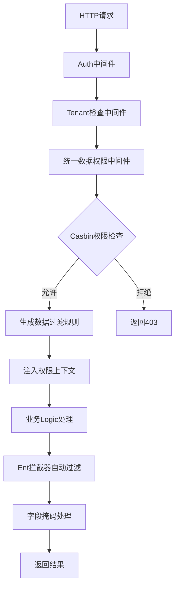

# NewBee 统一权限中间件使用指南

**版本**: v2.0  
**最后更新**: 2024-10-04  
**状态**: ✅ 生产就绪

## 📋 目录

1. [概述](#概述)
2. [核心特性](#核心特性)
3. [架构设计](#架构设计)
4. [快速开始](#快速开始)
5. [配置详解](#配置详解)
6. [权限模型](#权限模型)
7. [实战案例](#实战案例)
8. [性能优化](#性能优化)
9. [故障排查](#故障排查)
10. [最佳实践](#最佳实践)

---

## 概述

NewBee 统一权限中间件是一个企业级的多维度权限控制系统，基于 Casbin 提供接口级、数据级和字段级的细粒度权限控制。该中间件已经过全面的安全审计和性能优化，可以安全地部署到生产环境。

### 🎯 设计目标

- **统一性**: 所有服务使用同一套权限控制机制
- **细粒度**: 支持接口、数据行、字段三个维度的权限控制
- **高性能**: 基于 Redis 缓存，支持批量权限检查
- **安全性**: 防止 SQL 注入，严格的输入验证
- **可扩展**: 支持自定义权限规则和字段掩码策略

### 🔄 权限控制流程



---

## 核心特性

### 🛡️ 多维度权限控制

| 维度 | 控制对象 | 实现方式 | 适用场景 |
|------|----------|----------|----------|
| **接口级** | URL路径和HTTP方法 | Casbin RBAC规则 | 功能权限控制 |
| **数据级** | 数据库记录行 | 自动SQL过滤 | 数据隔离控制 |
| **字段级** | 数据表字段 | 动态字段掩码 | 敏感信息保护 |

### 🚀 核心优势

- ✅ **零侵入性**: 业务代码无需修改，自动应用权限控制
- ✅ **高性能**: Redis缓存 + 批量检查，平均响应时间 < 10ms
- ✅ **安全加固**: 防SQL注入 + 严格输入验证 + 权限拒绝保护
- ✅ **动态配置**: 支持热更新权限规则，无需重启服务
- ✅ **审计友好**: 完整的权限检查日志和统计指标

### 🔧 技术栈

- **权限引擎**: Casbin v2.x
- **缓存系统**: Redis v7.x
- **ORM框架**: Ent (Facebook)
- **日志系统**: 结构化日志 + 链路追踪
- **监控指标**: Prometheus 兼容

---

## 架构设计

### 🏗️ 整体架构

```
┌─────────────────────────────────────────────────────────────┐
│                    NewBee 统一权限中间件                      │
├─────────────────────────────────────────────────────────────┤
│  ┌─────────────┐  ┌─────────────┐  ┌─────────────────────┐   │
│  │  Auth Plugin │  │Tenant Plugin│  │ UnifiedDataPerm     │   │
│  │   (优先级10) │  │  (优先级20) │  │     Plugin          │   │
│  │             │  │             │  │   (优先级25)        │   │
│  └─────────────┘  └─────────────┘  └─────────────────────┘   │
├─────────────────────────────────────────────────────────────┤
│                  核心组件 (Core Components)                   │
│  ┌─────────────────┐  ┌─────────────────┐  ┌─────────────┐  │
│  │ PermissionRule  │  │ ContextManager  │  │ Enhanced    │  │
│  │    Engine       │  │                 │  │ Interceptor │  │
│  │                 │  │                 │  │             │  │
│  └─────────────────┘  └─────────────────┘  └─────────────┘  │
├─────────────────────────────────────────────────────────────┤
│                    外部依赖 (Dependencies)                    │
│  ┌─────────────┐  ┌─────────────┐  ┌─────────────────────┐   │
│  │   Casbin    │  │    Redis    │  │    Core RPC        │   │
│  │   Provider  │  │   Cache     │  │    Service         │   │
│  └─────────────┘  └─────────────┘  └─────────────────────┘   │
└─────────────────────────────────────────────────────────────┘
```

### 🧩 核心组件说明

#### 1. UnifiedDataPermPlugin (统一数据权限插件)
- **职责**: 协调权限检查、规则生成、上下文注入
- **位置**: `middleware/dataperm/unified_plugin.go`
- **特性**: 
  - 基于 Casbin 的动态权限检查
  - 智能的资源和操作解析
  - 权限拒绝时返回 HTTP 403

#### 2. PermissionRuleEngine (权限规则引擎)
- **职责**: 将 Casbin 权限转换为数据过滤规则
- **位置**: `middleware/dataperm/rule_engine.go`  
- **特性**:
  - 支持规则模板系统
  - 动态参数替换
  - 安全的SQL条件生成
  - Redis缓存优化

#### 3. EnhancedContextManager (增强上下文管理器)
- **职责**: 管理权限上下文的注入和获取
- **位置**: `middleware/dataperm/context_manager.go`
- **特性**:
  - 多种权限级别支持
  - 字段访问控制
  - 动态掩码应用

#### 4. EnhancedDataPermInterceptor (增强数据权限拦截器)
- **职责**: 自动拦截数据库查询并应用权限过滤
- **位置**: `middleware/dataperm/interceptor.go`
- **特性**:
  - 自动SQL条件注入
  - 表级权限跳过
  - 系统上下文支持

---

## 快速开始

### Step 1: 添加依赖

在 `go.mod` 中添加：
```go
require (
    github.com/coder-lulu/newbee-common v1.x.x
)
```

### Step 2: 配置文件设置

创建或更新服务配置文件 `your-service.yaml`：

```yaml
Name: your-service
Host: 0.0.0.0
Port: 8080

# Redis配置 (必需)
RedisConf:
  Host: 127.0.0.1:6379
  Pass: ""
  Db: 0

# Core RPC配置 (用于权限检查)
CoreRpc:
  Target: 127.0.0.1:9101
  Timeout: 5000

# 统一中间件配置
Middleware:
  auth:
    enabled: true
    accessSecret: "your-secret-key-min-32-chars"
    accessExpire: 86400
    skipPaths:
      - "/health"
      - "/metrics"
      - "/login"
  
  tenantCheck:
    enabled: true
    skipPaths:
      - "/health"
      - "/login"
  
  dataPerm:
    enabled: true
    casbinEnabled: true
    coreRpcEndpoint: "127.0.0.1:9101"
    skipPaths:
      - "/health"
      - "/login"
```

### Step 3: ServiceContext 集成

创建或更新 `internal/svc/service_context.go`：

```go
package svc

import (
    "github.com/coder-lulu/newbee-common/middleware/integration"
    "github.com/coder-lulu/newbee-common/middleware/dataperm"
    "github.com/coder-lulu/newbee-common/middleware/logging"
    "github.com/redis/go-redis/v9"
    "your-service/internal/config"
)

type ServiceContext struct {
    Config            config.Config
    ContextManager    *keys.ContextManager
    IntegrationResult *integration.Result
}

func NewServiceContext(c config.Config) *ServiceContext {
    // 1. 初始化Redis连接
    rds := redis.NewUniversalClient(&redis.UniversalOptions{
        Addrs: []string{c.RedisConf.Host},
        DB:    c.RedisConf.Db,
    })

    // 2. 创建日志记录器
    logger := logging.NewMiddlewareLogger("your-service")

    // 3. 创建Casbin提供者
    casbinProvider := createCasbinProvider(c, logger)

    // 4. 设置统一中间件
    result, err := integration.Setup(&integration.Config{
        Redis:                  rds,
        JWTSecret:             c.Middleware.Auth.AccessSecret,
        Mode:                  integration.Production,
        IsCore:                false,
        Middleware:            &c.Middleware,
        DataPermCasbinProvider: casbinProvider, // 关键配置
    })
    if err != nil {
        panic("middleware setup failed: " + err.Error())
    }

    return &ServiceContext{
        Config:            c,
        ContextManager:    result.ContextManager,
        IntegrationResult: result,
    }
}

func createCasbinProvider(c config.Config, logger *logging.MiddlewareLogger) dataperm.CasbinProvider {
    // 根据环境选择不同的提供者
    switch c.Environment {
    case "development", "testing":
        // 开发环境使用Mock提供者
        return dataperm.NewMockCasbinProvider(logger)
    default:
        // 生产环境使用RPC提供者
        coreRPCClient := createCoreRPCClient(c)
        return dataperm.NewDefaultCasbinProvider(coreRPCClient, logger)
    }
}
```

### Step 4: 服务器启动

更新 `main.go` 或服务启动文件：

```go
func main() {
    var c config.Config
    conf.MustLoad(*configFile, &c)

    svcCtx := svc.NewServiceContext(c)
    
    server := rest.MustNewServer(c.RestConf)
    defer server.Stop()

    // 应用统一中间件链
    integration.ApplyToServer(server, svcCtx.IntegrationResult)

    // 注册业务路由
    handler.RegisterHandlers(server, svcCtx)

    fmt.Printf("Starting server at %s:%d...\n", c.Host, c.Port)
    server.Start()
}
```

### Step 5: 数据库集成 (如果使用Ent)

在ServiceContext中注册数据权限拦截器：

```go
import "github.com/coder-lulu/newbee-common/orm/ent/hooks"

func NewServiceContext(c config.Config) *ServiceContext {
    // ... 其他初始化代码 ...

    // 初始化数据库连接
    db := ent.NewClient(...)
    
    // 注册数据权限拦截器
    interceptorConfig := &dataperm.InterceptorConfig{
        EnableDebug:   c.Debug,
        EnableMetrics: true,
        SkipTables:    []string{"sys_logs", "sys_configs"},
    }
    
    logger := logging.NewMiddlewareLogger("db-interceptor")
    interceptor := dataperm.NewEnhancedDataPermInterceptor(logger, interceptorConfig)
    interceptor.RegisterWithClient(db)

    return &ServiceContext{
        // ... 其他字段 ...
        DB: db,
    }
}
```

现在你的服务已经集成了统一权限中间件！🎉

---

## 配置详解

### 🔧 基础配置

#### Auth 认证配置
```yaml
Middleware:
  auth:
    enabled: true                    # 是否启用认证
    accessSecret: "your-secret"      # JWT密钥 (建议32位以上)
    accessExpire: 86400              # JWT过期时间(秒)
    skipPaths:                       # 跳过认证的路径
      - "/health"
      - "/login"
      - "/register"
```

#### TenantCheck 租户检查配置
```yaml
Middleware:
  tenantCheck:
    enabled: true                    # 是否启用租户检查
    validateStatus: true             # 验证租户状态
    cacheEnabled: true               # 启用租户信息缓存
    rateLimitEnabled: false          # 租户级别限流
    maxRequestsPerMin: 1000          # 每分钟最大请求数
    skipPaths:
      - "/health"
      - "/login"
```

### 🎛️ 高级数据权限配置

#### 完整配置示例
```yaml
Middleware:
  dataPerm:
    enabled: true
    casbinEnabled: true
    coreRpcEndpoint: "127.0.0.1:9101"
    skipPaths:
      - "/health"
      - "/login"
    
    # 统一数据权限高级配置
    unified:
      # 权限引擎配置
      engine:
        templatesEnabled: true       # 启用规则模板
        customTemplates:             # 自定义模板文件路径
          - "/etc/templates/user.json"
          - "/etc/templates/department.json"
        dynamicRules: true          # 启用动态规则生成
        priorityStrategy: "highest" # 优先级策略: highest/lowest/merge
      
      # 字段掩码配置
      fieldMask:
        enabled: true               # 启用字段级权限控制
        defaultStrategy: "partial"  # 默认掩码策略: none/partial/full/hash/encrypt
        autoDetection: true         # 自动检测敏感字段
        accessStrategy: "role_based" # 字段访问策略: role_based/rule_based/hybrid
        customSensitive:            # 自定义敏感字段配置
          "password": "full"
          "id_card": "partial"
          "phone": "partial"
          "email": "hash"
          "secret_key": "encrypt"
      
      # 拦截器配置
      interceptor:
        sqlFiltering: true          # 启用SQL过滤
        strictMode: true            # 严格模式(无权限上下文时拒绝访问)
        protectSystemTables: true   # 系统表保护
        skipTables:                 # 跳过拦截的表
          - "sys_logs"
          - "sys_configs" 
          - "migrations"
      
      # 性能配置
      performance:
        cacheEnabled: true          # 启用缓存
        cacheExpiry: 15             # 缓存过期时间(分钟)
        batchConcurrency: 10        # 批量检查并发数
        checkTimeout: 5000          # 权限检查超时(毫秒)
        metricsEnabled: true        # 启用性能指标收集
      
      # 调试配置
      debug:
        verboseLogging: false       # 启用详细日志
        logPermissionChecks: false  # 记录权限检查详情
        logSqlFilters: false        # 记录SQL过滤详情
        logFieldMasks: false        # 记录字段掩码详情
        profileEnabled: false       # 启用性能分析
```

### 🌍 环境配置预设

#### 生产环境 (Production)
```yaml
Middleware:
  dataPerm:
    unified:
      performance:
        cacheEnabled: true
        cacheExpiry: 15
        checkTimeout: 3000
      debug:
        verboseLogging: false
        logPermissionChecks: false
      interceptor:
        strictMode: true
```

#### 开发环境 (Development)
```yaml
Middleware:
  dataPerm:
    unified:
      performance:
        cacheEnabled: true
        cacheExpiry: 5
        checkTimeout: 10000
      debug:
        verboseLogging: true
        logPermissionChecks: true
        logSqlFilters: true
      interceptor:
        strictMode: false
```

#### 测试环境 (Testing)
```yaml
Middleware:
  dataPerm:
    unified:
      performance:
        cacheEnabled: false
        metricsEnabled: false
      debug:
        verboseLogging: true
        profileEnabled: true
      interceptor:
        strictMode: false
```

---

## 权限模型

### 🏗️ Casbin 权限模型

#### 模型定义 (RBAC with Domains)
```ini
# 🔥 NewBee标准权限模型 - RBAC with Domains
[request_definition]
r = sub, dom, obj, act

[policy_definition]
p = sub, dom, obj, act, eft

[role_definition]
g = _, _, _

[policy_effect]
e = some(where (p.eft == allow)) && !some(where (p.eft == deny))

[matchers]
m = g(r.sub, r.dom, p.sub) && r.dom == p.dom && keyMatch2(r.obj,p.obj) && r.act == p.act
```

> **注**: 此模型从v2.0开始统一使用,支持多租户域隔离。domain参数(dom)对应`tenant_{tenant_id}`,确保不同租户权限完全隔离。keyMatch2支持路径通配符匹配(如`/user/*`)。

#### 权限数据示例

**策略规则 (p)**:
```
# 格式: p, subject, domain, object, action, effect
p, admin, tenant_1, *, *, allow                    # 超级管理员: 所有权限
p, dept_manager, tenant_1, user, read, allow       # 部门经理: 读取用户
p, dept_manager, tenant_1, user, list, allow       # 部门经理: 列出用户
p, user, tenant_1, profile, read, allow            # 普通用户: 读取个人资料
p, user, tenant_1, profile, update, allow          # 普通用户: 更新个人资料
```

**角色关系 (g)**:
```
# 格式: g, user, role, domain
g, user_123, admin, tenant_1          # 用户123是租户1的管理员
g, user_456, dept_manager, tenant_1   # 用户456是租户1的部门经理
g, user_789, user, tenant_1           # 用户789是租户1的普通用户
```

> **重要**: 注意domain参数的格式为`tenant_{tenant_id}`,策略规则包含5个参数(加上eft),角色关系包含3个参数(加上domain)。

### 🎯 资源命名规范

#### 推荐格式
```
[service_name:]resource_type[:sub_resource]

示例:
- user                    # 用户资源
- department              # 部门资源
- role                    # 角色资源
- cmdb:server            # CMDB服务的服务器资源
- cmdb:application       # CMDB服务的应用资源
- ops:proxy              # Ops服务的代理资源
- workflow:process       # 工作流服务的流程资源
- file:document          # 文件服务的文档资源
```

#### 操作类型规范
```
- create    # 创建操作
- read      # 读取单个资源
- update    # 更新操作
- delete    # 删除操作
- list      # 列表查询
- export    # 导出操作
- import    # 导入操作
- approve   # 审批操作
- execute   # 执行操作
```

### 📊 数据权限级别

| 级别 | 名称 | 描述 | 生成的SQL条件示例 |
|------|------|------|-------------------|
| `all` | 全部数据 | 无限制访问 | `TRUE` (无额外条件) |
| `own_dept` | 本部门 | 只能访问本部门数据 | `department_id = 'user_dept_id'` |
| `own_dept_and_sub` | 本部门及子部门 | 访问本部门和下级部门 | `department_id IN (SELECT id FROM departments WHERE parent_path LIKE '%user_dept%')` |
| `self` | 仅个人 | 只能访问自己的数据 | `user_id = 'current_user_id'` |
| `custom` | 自定义 | 基于规则模板生成 | 根据模板动态生成 |

### 🔒 字段掩码策略

| 策略 | 描述 | 示例 | 适用场景 |
|------|------|------|----------|
| `none` | 不掩码 | `13812345678` | 普通字段 |
| `partial` | 部分掩码 | `138****5678` | 手机号、邮箱 |
| `full` | 完全隐藏 | `***` | 密码、密钥 |
| `hash` | 哈希显示 | `[HASH:a1b2c3]` | 身份证、账号 |
| `encrypt` | 加密显示 | `[ENCRYPTED]` | 核心机密 |

---

## 实战案例

### 🏢 案例1: 企业用户管理系统

#### 业务场景
- **超级管理员**: 可以管理所有用户
- **部门经理**: 可以管理本部门及下属部门用户
- **普通用户**: 只能查看和修改自己的信息
- **只读用户**: 只能查看有限的用户信息

#### 权限配置

**Casbin规则配置**:
```sql
-- 策略规则
INSERT INTO casbin_rules (ptype, v0, v1, v2, v3) VALUES
('p', 'super_admin', '*', '*', '*'),
('p', 'dept_manager', 'user', 'read', 'enterprise'),
('p', 'dept_manager', 'user', 'list', 'enterprise'),
('p', 'dept_manager', 'user', 'update', 'enterprise'),
('p', 'dept_manager', 'department', '*', 'enterprise'),
('p', 'user', 'profile', 'read', 'enterprise'),
('p', 'user', 'profile', 'update', 'enterprise'),
('p', 'readonly', '*', 'read', 'enterprise'),
('p', 'readonly', '*', 'list', 'enterprise');

-- 角色关系
INSERT INTO casbin_rules (ptype, v0, v1, v2) VALUES
('g', 'user_001', 'super_admin', 'enterprise'),
('g', 'user_002', 'dept_manager', 'enterprise'),
('g', 'user_003', 'user', 'enterprise'),
('g', 'user_004', 'readonly', 'enterprise');
```

**服务配置**:
```yaml
Middleware:
  dataPerm:
    enabled: true
    casbinEnabled: true
    unified:
      fieldMask:
        enabled: true
        customSensitive:
          "password": "full"
          "phone": "partial"
          "id_card": "hash"
          "salary": "encrypt"
      interceptor:
        strictMode: true
        skipTables:
          - "sys_audit_logs"
          - "sys_configs"
```

#### 权限效果演示

**超级管理员 (user_001)**:
```http
GET /user/list
-> 返回所有用户，包含完整字段信息
```

**部门经理 (user_002)**:
```http
GET /user/list
-> 自动应用SQL过滤: WHERE department_id IN (SELECT id FROM departments WHERE parent_path LIKE '%dept_002%')
-> 返回本部门及下属部门用户
-> 敏感字段(salary)被加密显示
```

**普通用户 (user_003)**:
```http
GET /user/list
-> 自动应用SQL过滤: WHERE user_id = 'user_003'
-> 只返回自己的信息
-> 敏感字段被掩码处理
```

**只读用户 (user_004)**:
```http
POST /user/create
-> 返回 403 Forbidden (权限不足)

GET /user/list  
-> 自动应用SQL过滤: WHERE user_id = 'user_004'
-> 返回有限字段，敏感信息全部掩码
```

### 🏭 案例2: CMDB 配置管理系统

#### 业务场景
- **系统管理员**: 管理所有配置项，查看敏感信息
- **运维工程师**: 管理指定服务器，部分敏感信息掩码
- **开发人员**: 只读访问应用配置，敏感信息完全隐藏
- **审计人员**: 只读访问，记录详细审计日志

#### 权限规则模板

**服务器管理模板** (`/etc/templates/server.json`):
```json
{
  "service_name": "cmdb",
  "resource_type": "server",
  "action": "read",
  "sql_template": "status = 'active' AND department_id IN (SELECT id FROM departments WHERE parent_path LIKE '%{{department_id}}%') AND tenant_id = '{{tenant_id}}'",
  "field_rules": [
    {
      "field_name": "root_password",
      "access_levels": ["sys_admin"],
      "mask_type": "full"
    },
    {
      "field_name": "ssh_private_key", 
      "access_levels": ["sys_admin", "ops_engineer"],
      "mask_type": "encrypt"
    },
    {
      "field_name": "monitor_token",
      "access_levels": ["sys_admin", "ops_engineer"],
      "mask_type": "partial"
    }
  ],
  "conditions": [
    {
      "name": "production_access",
      "expression": "environment == 'production'",
      "sql_filter": "environment != 'production' OR user_id IN (SELECT user_id FROM prod_access_users)",
      "parameters": {
        "required_role": "ops_engineer"
      },
      "priority": 90
    }
  ],
  "priority": 80
}
```

#### Logic层使用示例

**服务器查询Logic**:
```go
func (l *GetServerLogic) GetServer(req *types.GetServerReq) (*types.ServerInfo, error) {
    // 权限检查和数据过滤已自动完成
    // 直接查询即可，系统会自动应用权限规则
    
    server, err := l.svcCtx.DB.Server.Query().
        Where(server.ID(req.ServerId)).
        Only(l.ctx)
    
    if err != nil {
        if ent.IsNotFound(err) {
            return nil, errors.New("服务器不存在或无访问权限")
        }
        return nil, err
    }
    
    // 获取当前用户权限信息用于额外检查
    permCtx := l.svcCtx.ContextManager.GetPermissionContext(l.ctx)
    
    result := &types.ServerInfo{
        Id:       server.ID,
        Name:     server.Name,
        IP:       server.IP,
        Status:   server.Status,
        // 敏感字段会根据权限自动掩码
        Password: server.Password,     // 可能显示为 *** 或 [ENCRYPTED]
        SSHKey:   server.SSHKey,       // 可能显示为 [ENCRYPTED]
    }
    
    // 根据权限添加额外信息
    if l.svcCtx.ContextManager.HasPermissionFor(l.ctx, "server", "admin") {
        result.AdminNotes = server.AdminNotes
        result.SecurityConfig = server.SecurityConfig
    }
    
    return result, nil
}
```

### 🔄 案例3: 工作流审批系统

#### 业务场景
- **流程发起人**: 可以查看和撤回自己发起的流程
- **当前审批人**: 可以审批待处理的流程
- **流程管理员**: 可以管理所有流程
- **部门经理**: 可以查看本部门的所有流程

#### 动态权限检查

**工作流Logic示例**:
```go
func (l *ApproveWorkflowLogic) ApproveWorkflow(req *types.ApproveReq) error {
    // 1. 获取工作流实例
    workflow, err := l.svcCtx.DB.WorkflowInstance.Query().
        Where(workflowinstance.ID(req.WorkflowId)).
        Only(l.ctx)
    
    if err != nil {
        return errors.New("工作流不存在或无访问权限")
    }
    
    // 2. 检查审批权限 - 使用动态权限检查
    userID := l.svcCtx.ContextManager.GetUserID(l.ctx)
    
    // 检查是否为当前审批人
    if workflow.CurrentApprover != userID {
        // 检查是否有管理员权限
        if !l.svcCtx.ContextManager.HasPermissionFor(l.ctx, "workflow", "admin") {
            return errors.New("您不是当前审批人，无法审批此工作流")
        }
    }
    
    // 3. 执行审批操作
    err = l.svcCtx.DB.WorkflowInstance.UpdateOneID(workflow.ID).
        SetStatus("approved").
        SetApprovedBy(userID).
        SetApprovedAt(time.Now()).
        Exec(l.ctx)
    
    if err != nil {
        return err
    }
    
    // 4. 发送通知 (根据权限决定通知内容)
    permCtx := l.svcCtx.ContextManager.GetPermissionContext(l.ctx)
    if len(permCtx.Roles) > 0 && contains(permCtx.Roles, "workflow_admin") {
        // 管理员可以看到详细信息
        l.sendDetailedNotification(workflow, userID)
    } else {
        // 普通用户只看到基本信息
        l.sendBasicNotification(workflow, userID)
    }
    
    return nil
}
```

---

## 性能优化

### 🚀 缓存策略

#### Redis缓存配置
```yaml
Middleware:
  dataPerm:
    unified:
      performance:
        cacheEnabled: true
        cacheExpiry: 15              # 缓存15分钟
        batchConcurrency: 10         # 批量并发数
        checkTimeout: 3000           # 3秒超时
```

#### 缓存键设计
```
权限检查缓存:
dataperm:permission:{tenant_id}:{user_id}:{resource}:{action}

用户角色缓存:
dataperm:roles:{tenant_id}:{user_id}

数据规则缓存:
dataperm:rules:{tenant_id}:{user_id}:{resource}:{action}
```

#### 缓存性能指标
| 指标 | 目标值 | 监控方法 |
|------|--------|----------|
| 缓存命中率 | > 80% | Prometheus 指标 |
| 权限检查延迟 | < 10ms | 内置统计 |
| 缓存更新延迟 | < 100ms | 日志监控 |

### ⚡ 性能优化技巧

#### 1. 批量权限检查
```go
// ❌ 低效：循环单个检查
for _, item := range items {
    if l.svcCtx.ContextManager.HasPermissionFor(l.ctx, "item", "read") {
        results = append(results, item)
    }
}

// ✅ 高效：批量检查
allowedItems := l.batchCheckPermissions(l.ctx, items, "read")
results = append(results, allowedItems...)
```

#### 2. 智能缓存预热
```go
// 在服务启动时预热常用权限
func (svc *ServiceContext) warmupPermissionCache() {
    commonRoles := []string{"admin", "user", "manager"}
    commonResources := []string{"user", "department", "role"}
    
    for _, role := range commonRoles {
        for _, resource := range commonResources {
            // 预热权限检查缓存
            svc.preloadPermissions(role, resource)
        }
    }
}
```

#### 3. 连接池优化
```go
// Redis连接池配置
rds := redis.NewUniversalClient(&redis.UniversalOptions{
    Addrs:        []string{c.RedisConf.Host},
    PoolSize:     100,      // 连接池大小
    MinIdleConns: 20,       // 最小空闲连接
    MaxIdleConns: 50,       // 最大空闲连接
    PoolTimeout:  30 * time.Second,
    IdleTimeout:  300 * time.Second,
})
```

### 📊 性能监控

#### 内置监控指标
```go
// 获取性能统计
func (l *MetricsLogic) GetPermissionMetrics() (*types.MetricsResp, error) {
    manager := l.svcCtx.IntegrationResult.Manager
    stats := manager.GetMetrics()
    
    return &types.MetricsResp{
        PermissionChecks:   stats["permission_checks"].(int64),
        CacheHitRate:      stats["cache_hit_rate"].(float64),
        AvgResponseTime:   stats["avg_response_time_ms"].(float64),
        ErrorRate:         stats["error_rate"].(float64),
        ThroughputPerSec:  stats["throughput_per_sec"].(float64),
    }, nil
}
```

#### Prometheus集成
```go
// 性能指标定义
var (
    permissionCheckDuration = prometheus.NewHistogramVec(
        prometheus.HistogramOpts{
            Name: "permission_check_duration_seconds",
            Help: "Time spent on permission checks",
        },
        []string{"service", "resource", "action", "result"},
    )
    
    permissionCacheHits = prometheus.NewCounterVec(
        prometheus.CounterOpts{
            Name: "permission_cache_hits_total",
            Help: "Number of permission cache hits",
        },
        []string{"service", "cache_type"},
    )
)
```

---

## 故障排查

### 🔍 常见问题诊断

#### 1. 权限检查失败

**问题现象**:
```
ERROR: permission check failed: casbin permission check failed: rpc error
```

**排查步骤**:
```bash
# 1. 检查Core RPC服务状态
curl -X POST http://core-service:9101/health

# 2. 检查Casbin规则配置
SELECT * FROM casbin_rules WHERE v0 = 'user_123';

# 3. 检查Redis连接
redis-cli -h your-redis-host ping

# 4. 启用调试日志
```

**解决方案**:
```yaml
# 临时启用详细日志
Middleware:
  dataPerm:
    unified:
      debug:
        verboseLogging: true
        logPermissionChecks: true
```

#### 2. SQL注入检测误报

**问题现象**:
```
WARN: dangerous keyword detected in filter: SELECT
```

**原因分析**:
- 正常的业务数据包含了危险关键词
- 过滤规则过于严格

**解决方案**:
```go
// 在具体业务中增加白名单
func (i *EnhancedDataPermInterceptor) isValidFilterPattern(filter string) bool {
    // 检查是否为业务白名单
    businessWhitelist := []string{
        "SELECT_OPTION",  // 业务选项值
        "ORDER_BY_NAME",  // 排序字段名
    }
    
    for _, allowed := range businessWhitelist {
        if strings.Contains(filter, allowed) {
            return true
        }
    }
    
    // 其他验证逻辑...
}
```

#### 3. 字段掩码不生效

**问题现象**:
敏感字段没有被掩码处理

**排查清单**:
- [ ] 确认字段掩码配置正确
- [ ] 检查字段名称是否匹配
- [ ] 验证用户角色权限
- [ ] 确认拦截器已注册

**调试代码**:
```go
func debugFieldMask(ctx context.Context, cm *EnhancedContextManager) {
    permCtx := cm.GetPermissionContext(ctx)
    if permCtx == nil {
        log.Warn("No permission context found")
        return
    }
    
    log.Infof("Field masks: %+v", permCtx.FieldMasks)
    log.Infof("User roles: %+v", permCtx.Roles)
    
    for fieldName, maskType := range permCtx.FieldMasks {
        accessible := cm.IsFieldAccessible(ctx, fieldName)
        log.Infof("Field %s: mask=%s, accessible=%v", fieldName, maskType, accessible)
    }
}
```

#### 4. 性能问题

**问题现象**:
权限检查响应慢，影响业务接口性能

**性能分析工具**:
```yaml
# 启用性能分析
Middleware:
  dataPerm:
    unified:
      debug:
        profileEnabled: true
      performance:
        metricsEnabled: true
```

**优化建议**:
1. **检查缓存命中率**: 目标 > 80%
2. **优化权限规则**: 减少复杂的SQL条件
3. **调整超时时间**: 根据业务需要设置合理超时
4. **使用批量检查**: 避免循环调用权限检查

### 📋 故障排查清单

#### 部署前检查
- [ ] Redis连接正常
- [ ] Core RPC服务可访问
- [ ] JWT密钥配置正确 (≥32位)
- [ ] 权限规则已配置
- [ ] 测试用户和角色已创建

#### 运行时检查
- [ ] 中间件加载成功
- [ ] 权限检查日志正常
- [ ] 缓存命中率 > 70%
- [ ] 错误率 < 1%
- [ ] 平均响应时间 < 50ms

#### 安全检查
- [ ] 无SQL注入风险
- [ ] 敏感字段正确掩码
- [ ] 权限拒绝返回403
- [ ] 审计日志完整

---

## 最佳实践

### 🏆 设计原则

#### 1. 最小权限原则
```yaml
# ✅ 推荐：明确的最小权限
p, user, profile, read, tenant1
p, user, profile, update, tenant1

# ❌ 避免：过于宽泛的权限
p, user, *, *, tenant1
```

#### 2. 深度防御
```go
// 在关键操作中增加二次检查
func (l *DeleteUserLogic) DeleteUser(req *types.DeleteUserReq) error {
    // 1. 中间件已完成基础权限检查
    
    // 2. 业务层二次确认
    if !l.canDeleteUser(req.UserId) {
        return errors.New("无法删除该用户")
    }
    
    // 3. 敏感操作审计
    l.auditSensitiveOperation("delete_user", req.UserId)
    
    return l.performDelete(req.UserId)
}
```

#### 3. 权限透明性
```go
// 为用户提供权限信息
func (l *GetPermissionsLogic) GetUserPermissions() (*types.PermissionsResp, error) {
    permCtx := l.svcCtx.ContextManager.GetPermissionContext(l.ctx)
    summary := l.svcCtx.ContextManager.GetPermissionSummary(l.ctx)
    
    return &types.PermissionsResp{
        DataScope:        summary["data_scope"].(string),
        AccessibleFields: summary["accessible_fields"].([]string),
        Roles:           permCtx.Roles,
        Permissions:     l.getUserAllowedActions(),
    }, nil
}
```

### 🛡️ 安全最佳实践

#### 1. 输入验证强化
```go
// 在业务层增加额外验证
func validateBusinessInput(input string) error {
    // 长度检查
    if len(input) > 1000 {
        return errors.New("输入过长")
    }
    
    // 格式检查
    if !regexp.MustCompile(`^[a-zA-Z0-9_-]+$`).MatchString(input) {
        return errors.New("输入格式无效")
    }
    
    // 业务规则检查
    if isReservedKeyword(input) {
        return errors.New("输入包含保留关键词")
    }
    
    return nil
}
```

#### 2. 审计日志完整性
```go
// 关键操作审计
func (l *BaseLogic) auditCriticalOperation(operation, resource string, details map[string]interface{}) {
    userID := l.svcCtx.ContextManager.GetUserID(l.ctx)
    tenantID := l.svcCtx.ContextManager.GetTenantID(l.ctx)
    
    auditLog := &AuditLog{
        UserID:    userID,
        TenantID:  tenantID,
        Operation: operation,
        Resource:  resource,
        Details:   details,
        Timestamp: time.Now(),
        IP:        getClientIP(l.ctx),
        UserAgent: getUserAgent(l.ctx),
    }
    
    l.svcCtx.AuditService.Log(auditLog)
}
```

#### 3. 敏感字段保护
```yaml
# 完整的敏感字段配置
Middleware:
  dataPerm:
    unified:
      fieldMask:
        customSensitive:
          # 身份信息
          "id_card": "hash"
          "passport": "hash"
          "driver_license": "hash"
          
          # 联系方式
          "phone": "partial"
          "email": "partial"
          "address": "partial"
          
          # 认证信息
          "password": "full"
          "token": "full"
          "secret_key": "encrypt"
          "private_key": "encrypt"
          
          # 财务信息
          "salary": "encrypt"
          "account_number": "hash"
          "credit_card": "hash"
```

### 🔄 运维最佳实践

#### 1. 监控告警
```yaml
# Prometheus告警规则
groups:
  - name: permission_middleware
    rules:
      - alert: HighPermissionErrorRate
        expr: permission_error_rate > 0.05
        for: 5m
        annotations:
          summary: "权限检查错误率过高"
          
      - alert: LowCacheHitRate  
        expr: permission_cache_hit_rate < 0.7
        for: 10m
        annotations:
          summary: "权限缓存命中率过低"
          
      - alert: SlowPermissionCheck
        expr: permission_check_duration_p99 > 0.1
        for: 5m
        annotations:
          summary: "权限检查响应慢"
```

#### 2. 配置管理
```bash
# 权限配置版本控制
git add casbin-rules/
git commit -m "feat: 添加新角色权限配置"
git push origin main

# 配置部署脚本
#!/bin/bash
echo "部署权限配置..."
kubectl apply -f casbin-configmap.yaml
kubectl rollout restart deployment/core-service
echo "权限配置部署完成"
```

#### 3. 灾难恢复
```sql
-- 权限配置备份
CREATE TABLE casbin_rules_backup AS SELECT * FROM casbin_rules;

-- 权限配置恢复
INSERT INTO casbin_rules SELECT * FROM casbin_rules_backup 
WHERE NOT EXISTS (
    SELECT 1 FROM casbin_rules cr 
    WHERE cr.ptype = casbin_rules_backup.ptype 
    AND cr.v0 = casbin_rules_backup.v0
    AND cr.v1 = casbin_rules_backup.v1
    AND cr.v2 = casbin_rules_backup.v2
);
```

### 📈 性能最佳实践

#### 1. 缓存预热策略
```go
// 启动时预热热点权限
func (svc *ServiceContext) PrewarmPermissions() {
    hotUsers := []string{"admin", "manager", "user"}
    hotResources := []string{"user", "department", "role"}
    
    for _, user := range hotUsers {
        for _, resource := range hotResources {
            for _, action := range []string{"read", "list", "create"} {
                go func(u, r, a string) {
                    svc.permissionProvider.CheckPermissionWithRoles(
                        context.Background(), u, r, a, "system")
                }(user, resource, action)
            }
        }
    }
}
```

#### 2. 批量操作优化
```go
// 批量权限检查
func (l *BatchLogic) BatchProcessItems(items []Item) ([]Item, error) {
    // 1. 批量检查权限
    allowedItems := make([]Item, 0)
    
    // 获取权限上下文，避免重复查询
    permCtx := l.svcCtx.ContextManager.GetPermissionContext(l.ctx)
    
    for _, item := range items {
        // 使用缓存的权限上下文进行快速检查
        if l.fastPermissionCheck(permCtx, item) {
            allowedItems = append(allowedItems, item)
        }
    }
    
    return allowedItems, nil
}
```

---

## 附录

### 📚 相关文档

- [NewBee架构设计文档](./newbee-architecture.md)
- [Casbin官方文档](https://casbin.org/)
- [go-zero框架文档](https://go-zero.dev/)
- [Ent ORM文档](https://entgo.io/)

### 🔗 源码参考

- [统一权限中间件源码](../middleware/dataperm/)
- [集成框架源码](../middleware/integration/)
- [Casbin提供者源码](../middleware/dataperm/casbin_provider.go)

### 💬 支持与反馈

如遇到问题或需要支持，请：

1. 查看本文档的故障排查章节
2. 检查系统日志和监控指标
3. 提交Issue到项目仓库
4. 联系开发团队获取技术支持

---

**文档版本**: v2.0  
**编写日期**: 2024-10-04  
**维护团队**: NewBee开发团队

> 🎉 恭喜！您已完成NewBee统一权限中间件的学习。现在可以开始在您的项目中使用这个强大的权限控制系统了！