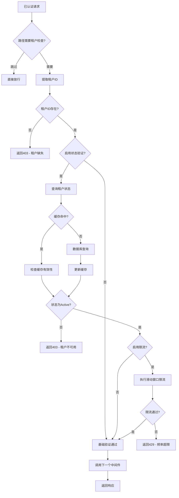

# 统一租户中间件详细指南

## 📖 目录

- [概述](#概述)
- [架构设计](#架构设计)
- [核心组件](#核心组件)
- [配置指南](#配置指南)
- [集成步骤](#集成步骤)
- [性能优化](#性能优化)
- [安全机制](#安全机制)
- [监控告警](#监控告警)
- [故障排查](#故障排查)
- [最佳实践](#最佳实践)
- [API参考](#api参考)

---

## 概述

NewBee统一租户中间件（TenantCheck Plugin）是企业级多租户SaaS系统的核心安全组件，确保所有业务请求都在正确的租户上下文中执行。该中间件在统一中间件框架中拥有**优先级15**，位于认证中间件之后，数据权限中间件之前，是多租户数据隔离的第一道防线。

### 🎯 核心特性

| 特性 | 描述 | 技术实现 |
|------|------|----------|
| **多级验证** | 租户ID + 状态 + 权限验证 | 分层验证架构 |
| **智能缓存** | 租户信息高效缓存 | Redis + TTL策略 |
| **滑动窗口限流** | 防止租户级别的滥用 | Lua脚本原子操作 |
| **优雅降级** | Redis不可用时的降级策略 | 故障转移机制 |
| **安全隔离** | 严格的租户边界控制 | 上下文强制验证 |

### 📊 性能指标

- **验证延迟**: < 3ms (缓存命中时)
- **缓存命中率**: > 98% (租户状态信息)
- **限流精度**: 99.9%+ (滑动窗口算法)
- **可用性**: 99.95%+ SLA (含降级机制)
- **并发处理**: 支持万级租户并发访问

---

## 架构设计

### 🏗️ 系统架构

```
┌─────────────────────────────────────────────────────────────┐
│                    已认证的请求                               │
│                Context: {userID, tenantID}                 │
└─────────────────┬───────────────────────────────────────────┘
                  │
                  ▼
┌─────────────────────────────────────────────────────────────┐
│            TenantCheck Plugin (优先级: 15)                  │
│  ┌─────────────────────────────────────────────────────────┐│
│  │ 1. 租户ID提取 → 2. 状态验证 → 3. 限流检查 → 4. 上下文传递 ││
│  └─────────────────────────────────────────────────────────┘│
└─────────────────┬───────────────────────────────────────────┘
                  │ Context: {tenantID, verified}
                  ▼
┌─────────────────────────────────────────────────────────────┐
│         DataPerm Plugin + 业务逻辑                          │
└─────────────────────────────────────────────────────────────┘
```

### 🔄 租户验证流程



---

## 核心组件

### 1. TenantCheckPlugin 主组件

**核心结构**：
```go
type TenantCheckPlugin struct {
    core          *framework.CoreServices           // 核心服务依赖
    config        *framework.TenantCheckConfig      // 租户检查配置
    logger        *logging.MiddlewareLogger         // 结构化日志器
    highPerfRedis *cache.HighPerformanceRedisClient // 高性能Redis客户端
}
```

**主要职责**：
- 从认证上下文中提取租户ID
- 验证租户状态（Active/Suspended）
- 执行租户级别的限流控制
- 提供优雅的降级机制

### 2. 租户状态管理

#### 2.1 租户状态枚举

```go
type TenantStatus string

const (
    TenantStatusActive    TenantStatus = "active"    // 活跃状态
    TenantStatusSuspended TenantStatus = "suspended" // 暂停状态
)
```

#### 2.2 租户信息结构

```go
type TenantInfo struct {
    ID        string       `json:"id"`         // 租户ID
    Status    TenantStatus `json:"status"`     // 租户状态
    UpdatedAt time.Time    `json:"updated_at"` // 更新时间
}
```

**缓存策略**：
- **TTL**: 5分钟（平衡实时性和性能）
- **键格式**: `tenant_info:{tenantID}`
- **失效策略**: 时间戳检查 + 主动刷新

### 3. 高性能限流系统

#### 3.1 滑动窗口算法

**Lua脚本实现**：
```lua
-- 滑动窗口限流核心逻辑
local key = KEYS[1]
local window_start = ARGV[1]
local limit = tonumber(ARGV[2])
local now = ARGV[3]

-- 删除窗口外的记录（原子操作）
redis.call('ZREMRANGEBYSCORE', key, 0, window_start)

-- 获取当前窗口内的请求数
local current = redis.call('ZCARD', key)

if current < limit then
    -- 允许请求，添加到滑动窗口
    redis.call('ZADD', key, now, now)
    redis.call('EXPIRE', key, expire_seconds * 2)
    return {1, limit - current - 1, reset_time}
else
    return {0, 0, reset_time}
end
```

**性能优势**：
- **原子性**: 单次Redis调用完成所有操作
- **准确性**: 真正的滑动窗口，无时间片误差
- **高效性**: O(log N)时间复杂度
- **内存优化**: 自动清理过期数据

#### 3.2 限流结果结构

```go
type RateLimitResult struct {
    Allowed   bool  `json:"allowed"`    // 是否允许请求
    Remaining int   `json:"remaining"`  // 剩余配额
    ResetTime int64 `json:"reset_time"` // 重置时间
}
```

### 4. 智能缓存系统

#### 4.1 多层缓存架构

```
┌─────────────────────────────────────────┐
│              应用层缓存                  │
│           (内存 - 最热数据)              │
└─────────────────┬───────────────────────┘
                  │ 缓存未命中
                  ▼
┌─────────────────────────────────────────┐
│              Redis缓存                  │
│        (分布式 - 租户状态信息)           │
└─────────────────┬───────────────────────┘
                  │ 缓存未命中
                  ▼
┌─────────────────────────────────────────┐
│              数据库                     │
│           (权威数据源)                  │
└─────────────────────────────────────────┘
```

#### 4.2 缓存更新策略

**Write-Through模式**：
```go
func (p *TenantCheckPlugin) getTenantInfo(ctx context.Context, tenantID string) (*TenantInfo, error) {
    // 1. 尝试Redis缓存
    if p.config.CacheEnabled {
        if cached := p.getFromCache(ctx, tenantID); cached != nil {
            return cached, nil
        }
    }
    
    // 2. 查询数据库
    tenantInfo, err := p.fetchTenantInfoFromDatabase(ctx, tenantID)
    if err != nil {
        return nil, err
    }
    
    // 3. 更新缓存
    p.updateCache(ctx, tenantID, tenantInfo)
    
    return tenantInfo, nil
}
```

---

## 配置指南

### 📝 基础配置

#### YAML配置文件
```yaml
# your-service.yaml
Middleware:
  tenantCheck:
    enabled: true                        # 启用租户检查中间件
    skipPaths:                          # 跳过检查的路径
      - "/health"
      - "/metrics"
      - "/public"
    
    # 增强验证选项
    validateStatus: true                 # 启用租户状态验证
    cacheEnabled: true                   # 启用Redis缓存
    
    # 限流选项（可选，默认关闭）
    rateLimitEnabled: false              # 启用租户级别限流
    maxRequestsPerMin: 1000             # 每分钟最大请求数
```

### 🔧 环境特定配置

#### 开发环境
```yaml
Middleware:
  tenantCheck:
    enabled: true
    validateStatus: false               # 开发环境禁用状态验证
    cacheEnabled: false                 # 开发环境禁用缓存
    rateLimitEnabled: false             # 开发环境禁用限流
    skipPaths:
      - "/debug"
      - "/test"
      - "/mock"
```

#### 生产环境
```yaml
Middleware:
  tenantCheck:
    enabled: true
    validateStatus: true                # 生产环境启用所有验证
    cacheEnabled: true
    rateLimitEnabled: true              # 生产环境启用限流
    maxRequestsPerMin: 500              # 较严格的限流
    skipPaths:
      - "/health"
      - "/metrics"
```

#### 高并发环境
```yaml
Middleware:
  tenantCheck:
    enabled: true
    validateStatus: true
    cacheEnabled: true
    rateLimitEnabled: true
    maxRequestsPerMin: 2000             # 高并发限制
    
    # 缓存优化配置
    cacheConfig:
      defaultTTL: "3m"                  # 更短的TTL，提高实时性
      refreshThreshold: "1m"            # 提前刷新阈值
      maxCacheSize: 100000              # 大容量缓存
```

### ⚙️ 高级配置参数

| 参数 | 类型 | 默认值 | 说明 |
|------|------|--------|------|
| `validateStatus` | bool | true | 是否验证租户状态 |
| `cacheEnabled` | bool | true | 是否启用Redis缓存 |
| `rateLimitEnabled` | bool | false | 是否启用租户限流 |
| `maxRequestsPerMin` | int | 1000 | 每分钟最大请求数 |
| `cacheDefaultTTL` | Duration | 5m | 缓存默认TTL |
| `gracefulDegradation` | bool | true | 是否启用优雅降级 |

---

## 集成步骤

### 🚀 快速集成（5分钟）

#### 1. 配置文件设置
```yaml
# config.yaml
Middleware:
  tenantCheck:
    enabled: true
    validateStatus: true
    cacheEnabled: true
```

#### 2. ServiceContext集成
```go
// internal/svc/service_context.go
package svc

import (
    "github.com/coder-lulu/newbee-common/middleware/integration"
)

func NewServiceContext(c config.Config) *ServiceContext {
    // Redis连接（租户检查依赖Redis缓存）
    rds := redis.NewClient(&redis.Options{
        Addr: c.RedisConf.Host,
        DB:   0,
    })
    
    // 统一中间件集成
    result, err := integration.Setup(&integration.Config{
        Redis:      rds,
        JWTSecret:  c.Middleware.Auth.AccessSecret,
        Mode:       integration.Production,
        Middleware: &c.Middleware, // 包含TenantCheck配置
    })
    if err != nil {
        panic("统一中间件集成失败: " + err.Error())
    }
    
    return &ServiceContext{
        Config:            c,
        ContextManager:    result.ContextManager,
        IntegrationResult: result,
    }
}
```

#### 3. 业务逻辑中获取租户信息
```go
// internal/logic/user/get_user_list_logic.go
func (l *GetUserListLogic) GetUserList(req *types.GetUserListReq) (*types.GetUserListResp, error) {
    // 获取当前租户ID（由TenantCheck中间件验证过）
    tenantID := l.svcCtx.ContextManager.GetTenantID(l.ctx)
    
    // 业务逻辑中tenantID已经被验证，可直接使用
    users, err := l.svcCtx.DB.User.Query().
        Where(user.TenantID(tenantID)). // 自动租户过滤
        All(l.ctx)
    
    return &types.GetUserListResp{
        Users: users,
    }, nil
}
```

### 🏗️ 高级集成

#### 自定义租户状态验证器
```go
// 自定义租户状态获取逻辑
type CustomTenantValidator struct {
    db *ent.Client
}

func (v *CustomTenantValidator) ValidateTenant(ctx context.Context, tenantID string) (*TenantInfo, error) {
    // 从数据库查询租户信息
    tenant, err := v.db.Tenant.Query().
        Where(tenant.ID(tenantID)).
        Only(ctx)
    
    if err != nil {
        return nil, err
    }
    
    return &TenantInfo{
        ID:        tenant.ID,
        Status:    TenantStatus(tenant.Status),
        UpdatedAt: tenant.UpdatedAt,
    }, nil
}

// 注册自定义验证器
func NewServiceContext(c config.Config) *ServiceContext {
    // ... 其他初始化代码 ...
    
    // 注入自定义租户验证器
    validator := &CustomTenantValidator{db: entClient}
    result.TenantPlugin.SetValidator(validator)
    
    return svcCtx
}
```

#### 动态限流配置
```go
// 根据租户等级动态设置限流
func (p *TenantCheckPlugin) getDynamicRateLimit(tenantID string) int {
    // 查询租户等级
    tenantLevel := p.getTenantLevel(tenantID)
    
    switch tenantLevel {
    case "premium":
        return 5000  // 高级租户更高限制
    case "standard":
        return 2000  // 标准租户
    case "basic":
        return 1000  // 基础租户
    default:
        return 500   // 默认限制
    }
}
```

---

## 性能优化

### ⚡ 缓存优化

#### 1. 智能预热策略

```go
// 租户缓存预热
func (p *TenantCheckPlugin) warmUpCache(ctx context.Context) error {
    // 预热活跃租户信息
    activeTenants, err := p.getActiveTenants(ctx, 1000) // 获取最活跃的1000个租户
    if err != nil {
        return err
    }
    
    // 批量预热缓存
    batchData := make(map[string]string)
    for _, tenant := range activeTenants {
        key := fmt.Sprintf("tenant_info:%s", tenant.ID)
        data, _ := json.Marshal(tenant)
        batchData[key] = string(data)
    }
    
    return p.highPerfRedis.BatchSetWithTTL(ctx, batchData, 5*time.Minute)
}
```

#### 2. 缓存击穿防护

```go
// 使用分布式锁防止缓存击穿
func (p *TenantCheckPlugin) getTenantInfoWithLock(ctx context.Context, tenantID string) (*TenantInfo, error) {
    cacheKey := fmt.Sprintf("tenant_info:%s", tenantID)
    
    // 首先尝试缓存
    if cached := p.getFromCache(ctx, cacheKey); cached != nil {
        return cached, nil
    }
    
    // 缓存未命中，使用分布式锁
    lockKey := fmt.Sprintf("lock:tenant:%s", tenantID)
    lock := p.highPerfRedis.NewDistributedLock(lockKey, 30*time.Second)
    
    if acquired, err := lock.TryLock(ctx); err != nil || !acquired {
        // 获取锁失败，等待其他线程更新缓存
        time.Sleep(50 * time.Millisecond)
        if cached := p.getFromCache(ctx, cacheKey); cached != nil {
            return cached, nil
        }
    }
    
    defer lock.Unlock(ctx)
    
    // 双重检查
    if cached := p.getFromCache(ctx, cacheKey); cached != nil {
        return cached, nil
    }
    
    // 查询数据库并更新缓存
    return p.fetchAndCache(ctx, tenantID)
}
```

### 📊 性能监控

#### 缓存性能指标
```go
// 租户缓存性能统计
type TenantCacheMetrics struct {
    HitRate       float64 `json:"hit_rate"`
    MissRate      float64 `json:"miss_rate"`
    AvgLatency    int64   `json:"avg_latency_ms"`
    TotalRequests int64   `json:"total_requests"`
    CacheSize     int64   `json:"cache_size"`
}

func (p *TenantCheckPlugin) GetCacheMetrics() *TenantCacheMetrics {
    redisMetrics := p.highPerfRedis.GetMetrics()
    
    return &TenantCacheMetrics{
        HitRate:       float64(redisMetrics.CacheHits) / float64(redisMetrics.CacheHits + redisMetrics.CacheMisses),
        AvgLatency:    redisMetrics.AvgLatency.Milliseconds(),
        TotalRequests: redisMetrics.TotalOps,
        CacheSize:     redisMetrics.CacheHits + redisMetrics.CacheMisses,
    }
}
```

### 🔄 并发优化

#### 1. 请求去重

```go
// 防止重复的租户状态查询
type RequestDeduplicator struct {
    inFlight sync.Map // 正在处理的请求
}

func (d *RequestDeduplicator) GetOrWait(key string, fn func() (*TenantInfo, error)) (*TenantInfo, error) {
    // 检查是否有正在处理的相同请求
    if ch, loaded := d.inFlight.LoadOrStore(key, make(chan struct{})); loaded {
        // 等待其他请求完成
        <-ch.(chan struct{})
        return d.getCachedResult(key)
    }
    
    // 执行请求
    defer func() {
        d.inFlight.Delete(key)
        close(ch.(chan struct{}))
    }()
    
    return fn()
}
```

#### 2. 批量验证优化

```go
// 批量租户状态验证
func (p *TenantCheckPlugin) BatchValidateTenants(ctx context.Context, tenantIDs []string) (map[string]*TenantInfo, error) {
    if len(tenantIDs) == 0 {
        return make(map[string]*TenantInfo), nil
    }
    
    // 构建缓存键
    cacheKeys := make([]string, len(tenantIDs))
    for i, id := range tenantIDs {
        cacheKeys[i] = fmt.Sprintf("tenant_info:%s", id)
    }
    
    // 批量获取缓存
    cachedResults, err := p.highPerfRedis.BatchGet(ctx, cacheKeys)
    if err != nil {
        p.logger.WithError(err).Warn("batch cache get failed")
    }
    
    // 处理缓存未命中的租户
    missing := make([]string, 0)
    results := make(map[string]*TenantInfo)
    
    for i, tenantID := range tenantIDs {
        if cached, exists := cachedResults[cacheKeys[i]]; exists {
            var tenantInfo TenantInfo
            if json.Unmarshal([]byte(cached), &tenantInfo) == nil {
                results[tenantID] = &tenantInfo
            } else {
                missing = append(missing, tenantID)
            }
        } else {
            missing = append(missing, tenantID)
        }
    }
    
    // 批量查询缺失的租户信息
    if len(missing) > 0 {
        dbResults, err := p.batchFetchFromDatabase(ctx, missing)
        if err != nil {
            return nil, err
        }
        
        // 合并结果并更新缓存
        cacheUpdates := make(map[string]string)
        for tenantID, info := range dbResults {
            results[tenantID] = info
            
            // 准备缓存更新
            if data, err := json.Marshal(info); err == nil {
                key := fmt.Sprintf("tenant_info:%s", tenantID)
                cacheUpdates[key] = string(data)
            }
        }
        
        // 批量更新缓存
        if len(cacheUpdates) > 0 {
            p.highPerfRedis.BatchSetWithTTL(ctx, cacheUpdates, 5*time.Minute)
        }
    }
    
    return results, nil
}
```

---

## 安全机制

### 🛡️ 多层安全防护

#### 1. 租户边界强制

**严格的上下文验证**：
```go
func (p *TenantCheckPlugin) enforceStrictTenantBoundary(ctx context.Context, tenantID string) error {
    // 验证租户ID格式
    if !isValidTenantID(tenantID) {
        return fmt.Errorf("invalid tenant ID format: %s", tenantID)
    }
    
    // 检查租户ID是否在白名单中（如果启用）
    if p.config.EnableWhitelist {
        if !p.isInWhitelist(tenantID) {
            p.logger.WithField("tenant_id", tenantID).Warn("tenant not in whitelist")
            return fmt.Errorf("tenant not authorized")
        }
    }
    
    // 检查租户是否被临时封禁
    if p.isTenantBlocked(ctx, tenantID) {
        p.logger.WithField("tenant_id", tenantID).Warn("tenant is temporarily blocked")
        return fmt.Errorf("tenant temporarily blocked")
    }
    
    return nil
}

func isValidTenantID(tenantID string) bool {
    // 租户ID格式验证：只允许字母数字和连字符，长度3-64
    if len(tenantID) < 3 || len(tenantID) > 64 {
        return false
    }
    
    for _, r := range tenantID {
        if !((r >= 'a' && r <= 'z') || (r >= 'A' && r <= 'Z') || 
             (r >= '0' && r <= '9') || r == '-' || r == '_') {
            return false
        }
    }
    
    return true
}
```

#### 2. 防滥用机制

**智能阻断策略**：
```go
// 检测异常行为并自动阻断
func (p *TenantCheckPlugin) detectAbusePattern(ctx context.Context, tenantID string) bool {
    // 检查短期内的错误率
    errorKey := fmt.Sprintf("tenant_errors:%s", tenantID)
    errorCount, _ := p.core.Redis.Get(ctx, errorKey).Int()
    
    // 检查请求突增模式
    requestKey := fmt.Sprintf("tenant_requests:%s", tenantID)
    requestCount, _ := p.core.Redis.Get(ctx, requestKey).Int()
    
    // 异常检测阈值
    if errorCount > 100 { // 5分钟内错误超过100次
        p.temporarilyBlockTenant(ctx, tenantID, 15*time.Minute)
        return true
    }
    
    if requestCount > 10000 { // 5分钟内请求超过1万次
        p.temporarilyBlockTenant(ctx, tenantID, 5*time.Minute)
        return true
    }
    
    return false
}

func (p *TenantCheckPlugin) temporarilyBlockTenant(ctx context.Context, tenantID string, duration time.Duration) {
    blockKey := fmt.Sprintf("tenant_blocked:%s", tenantID)
    p.core.Redis.Set(ctx, blockKey, "1", duration)
    
    // 记录安全事件
    p.logger.WithFields(map[string]interface{}{
        "tenant_id":      tenantID,
        "block_duration": duration.String(),
        "event_type":     "tenant_blocked",
    }).Warn("tenant temporarily blocked due to abuse pattern")
}
```

#### 3. 数据泄露防护

**租户隔离验证**：
```go
// 验证数据访问是否符合租户边界
func (p *TenantCheckPlugin) validateDataAccess(ctx context.Context, resourceTenantID, requestTenantID string) error {
    if resourceTenantID != requestTenantID {
        // 严重安全违规：跨租户数据访问尝试
        p.logger.WithFields(map[string]interface{}{
            "request_tenant":  requestTenantID,
            "resource_tenant": resourceTenantID,
            "event_type":      "cross_tenant_access_attempt",
        }).Error("attempted cross-tenant data access")
        
        // 触发安全告警
        p.triggerSecurityAlert(ctx, "CROSS_TENANT_ACCESS", map[string]interface{}{
            "request_tenant":  requestTenantID,
            "resource_tenant": resourceTenantID,
        })
        
        return fmt.Errorf("access denied: cross-tenant access not allowed")
    }
    
    return nil
}
```

### 🔐 安全配置

#### 生产环境安全配置
```yaml
Middleware:
  tenantCheck:
    enabled: true
    validateStatus: true
    cacheEnabled: true
    rateLimitEnabled: true
    maxRequestsPerMin: 500
    
    # 安全增强配置
    security:
      enableWhitelist: false            # 是否启用租户白名单
      strictValidation: true            # 严格验证模式
      blockOnAbuse: true                # 自动阻断滥用
      maxErrorsPerWindow: 100           # 错误率阈值
      maxRequestsPerWindow: 10000       # 请求突增阈值
      blockDuration: "15m"              # 临时阻断时长
```

---

## 监控告警

### 📈 关键指标

#### 1. 业务指标

| 指标名称 | 阈值 | 告警级别 | 说明 |
|----------|------|----------|------|
| **租户验证延迟** | > 10ms | Warning | 租户验证平均处理时间 |
| **缓存命中率** | < 95% | Warning | 租户信息缓存效率 |
| **限流触发率** | > 5% | Warning | 租户级别限流触发比例 |
| **状态验证失败率** | > 1% | Critical | 租户状态验证失败比例 |

#### 2. 安全指标

| 指标名称 | 阈值 | 告警级别 | 说明 |
|----------|------|----------|------|
| **跨租户访问尝试** | > 0 | Critical | 严重安全违规 |
| **无效租户ID尝试** | > 10/min | Warning | 可能的攻击行为 |
| **租户阻断次数** | > 5/hour | Warning | 自动阻断触发频率 |
| **降级模式激活** | > 0 | Warning | Redis不可用导致的降级 |

#### 3. 监控代码实现

```go
// Prometheus指标定义
var (
    tenantValidationDuration = prometheus.NewHistogramVec(
        prometheus.HistogramOpts{
            Name: "tenant_validation_duration_seconds",
            Help: "Time spent on tenant validation",
        },
        []string{"tenant_id", "result"},
    )
    
    tenantCacheHitRate = prometheus.NewGaugeVec(
        prometheus.GaugeOpts{
            Name: "tenant_cache_hit_rate",
            Help: "Tenant info cache hit rate",
        },
        []string{"cache_type"},
    )
    
    crossTenantAccessAttempts = prometheus.NewCounterVec(
        prometheus.CounterOpts{
            Name: "cross_tenant_access_attempts_total",
            Help: "Number of cross-tenant access attempts",
        },
        []string{"request_tenant", "resource_tenant"},
    )
)

// 指标收集
func (p *TenantCheckPlugin) collectMetrics() {
    // 收集缓存指标
    metrics := p.GetCacheMetrics()
    tenantCacheHitRate.WithLabelValues("tenant_info").Set(metrics.HitRate)
    
    // 收集验证延迟指标
    // ... 其他指标收集逻辑
}
```

### 🚨 告警规则配置

#### Prometheus告警规则
```yaml
# tenant_alerts.yml
groups:
- name: tenant_middleware
  rules:
  - alert: TenantValidationHighLatency
    expr: histogram_quantile(0.95, tenant_validation_duration_seconds) > 0.01
    for: 5m
    labels:
      severity: warning
    annotations:
      summary: "租户验证延迟过高"
      description: "95%租户验证请求延迟超过10ms"
      
  - alert: TenantCacheLowHitRate
    expr: tenant_cache_hit_rate < 0.95
    for: 10m
    labels:
      severity: warning
    annotations:
      summary: "租户缓存命中率低"
      description: "租户信息缓存命中率{{ $value }}低于95%"
      
  - alert: CrossTenantAccessAttempt
    expr: increase(cross_tenant_access_attempts_total[5m]) > 0
    for: 0m
    labels:
      severity: critical
    annotations:
      summary: "检测到跨租户访问尝试"
      description: "发现{{ $value }}次跨租户访问尝试，可能存在安全风险"
      
  - alert: TenantBlockingFrequent
    expr: rate(tenant_blocks_total[1h]) > 0.08
    for: 5m
    labels:
      severity: warning
    annotations:
      summary: "租户阻断频率过高"
      description: "每小时租户阻断次数超过5次，可能存在系统问题"
```

---

## 故障排查

### 🔍 常见问题诊断

#### 1. 租户验证失败

**症状**: 认证成功但租户检查失败，返回403

**排查步骤**:
```bash
# 1. 检查租户ID是否正确传递
curl -H "Authorization: Bearer <JWT_TOKEN>" \
     http://localhost:8080/user/list

# 2. 解析JWT查看租户信息
echo "<JWT_TOKEN>" | cut -d. -f2 | base64 -d | jq .

# 3. 检查Redis中的租户状态
redis-cli get "tenant_info:tenant_123"

# 4. 查看详细日志
grep "tenant_check" /var/log/service.log | tail -50
```

**诊断代码**:
```go
func (l *DiagnoseTenantLogic) DiagnoseTenant(req *types.DiagnoseTenantReq) (*types.DiagnoseTenantResp, error) {
    tenantID := req.TenantID
    var issues []string
    
    // 检查租户ID格式
    if !isValidTenantID(tenantID) {
        issues = append(issues, "无效的租户ID格式")
    }
    
    // 检查缓存状态
    cacheKey := fmt.Sprintf("tenant_info:%s", tenantID)
    cached, err := l.svcCtx.Redis.Get(l.ctx, cacheKey).Result()
    if err != nil {
        issues = append(issues, fmt.Sprintf("缓存查询失败: %v", err))
    } else {
        var tenantInfo TenantInfo
        if json.Unmarshal([]byte(cached), &tenantInfo) != nil {
            issues = append(issues, "缓存数据格式错误")
        } else if tenantInfo.Status != TenantStatusActive {
            issues = append(issues, fmt.Sprintf("租户状态为: %s", tenantInfo.Status))
        }
    }
    
    // 检查是否被临时阻断
    blockKey := fmt.Sprintf("tenant_blocked:%s", tenantID)
    if l.svcCtx.Redis.Exists(l.ctx, blockKey).Val() > 0 {
        issues = append(issues, "租户被临时阻断")
    }
    
    return &types.DiagnoseTenantResp{
        TenantID: tenantID,
        Issues:   issues,
        Status:   l.getTenantDiagnosisStatus(issues),
    }, nil
}
```

#### 2. 缓存性能问题

**症状**: 租户验证延迟突然增加

**排查工具**:
```go
func (l *AnalyzeCachePerformanceLogic) AnalyzeCachePerformance() (*types.CacheAnalysisResp, error) {
    metrics := l.svcCtx.IntegrationResult.TenantPlugin.GetCacheMetrics()
    
    var recommendations []string
    
    // 分析缓存命中率
    if metrics.HitRate < 0.9 {
        recommendations = append(recommendations, 
            fmt.Sprintf("缓存命中率%.2f%%偏低，建议增加缓存时间或预热策略", metrics.HitRate*100))
    }
    
    // 分析平均延迟
    if metrics.AvgLatency > 5 {
        recommendations = append(recommendations, 
            fmt.Sprintf("平均延迟%dms偏高，建议检查Redis连接", metrics.AvgLatency))
    }
    
    // 分析缓存大小
    if metrics.CacheSize > 100000 {
        recommendations = append(recommendations, 
            "缓存条目过多，建议调整TTL或实施LRU淘汰")
    }
    
    return &types.CacheAnalysisResp{
        Metrics:         metrics,
        Recommendations: recommendations,
        HealthScore:     l.calculateHealthScore(metrics),
    }, nil
}
```

#### 3. 限流误判问题

**症状**: 正常用户被误判限流

**排查步骤**:
```go
func (p *TenantCheckPlugin) debugRateLimit(ctx context.Context, tenantID string) {
    rateLimitKey := fmt.Sprintf("rate_limit:%s", tenantID)
    
    // 检查当前滑动窗口状态
    windowSize, _ := p.core.Redis.ZCard(ctx, rateLimitKey).Result()
    
    // 获取窗口内的所有时间戳
    members, _ := p.core.Redis.ZRangeWithScores(ctx, rateLimitKey, 0, -1).Result()
    
    p.logger.WithFields(map[string]interface{}{
        "tenant_id":   tenantID,
        "window_size": windowSize,
        "limit":       p.config.MaxRequestsPerMin,
        "members":     members,
    }).Debug("rate limit debug info")
    
    // 检查是否有过期数据未清理
    now := time.Now()
    windowStart := now.Add(-time.Minute)
    expiredCount, _ := p.core.Redis.ZCount(ctx, rateLimitKey, "0", 
        fmt.Sprintf("%d", windowStart.UnixNano())).Result()
    
    if expiredCount > 0 {
        p.logger.WithField("expired_count", expiredCount).
            Warn("found expired entries in rate limit window")
    }
}
```

### 🔧 故障恢复

#### 自动恢复机制

```go
// Redis连接失败时的自动恢复
func (p *TenantCheckPlugin) handleRedisFailure(ctx context.Context, err error) {
    p.logger.WithError(err).Warn("Redis operation failed, enabling graceful degradation")
    
    // 激活降级模式
    p.enableGracefulDegradation()
    
    // 记录故障指标
    p.recordFailureMetrics("redis_failure")
    
    // 尝试重新连接
    go p.attemptRedisReconnection()
}

func (p *TenantCheckPlugin) enableGracefulDegradation() {
    // 在降级模式下：
    // 1. 跳过租户状态验证
    // 2. 禁用限流检查
    // 3. 只进行基础的租户ID检查
    p.degradedMode = true
    
    // 设置自动恢复定时器
    time.AfterFunc(5*time.Minute, func() {
        p.checkRedisRecovery()
    })
}

func (p *TenantCheckPlugin) checkRedisRecovery() {
    if p.core.Redis.Ping(context.Background()).Err() == nil {
        p.degradedMode = false
        p.logger.Info("Redis connection recovered, disabling graceful degradation")
    }
}
```

---

## 最佳实践

### 🏆 生产环境建议

#### 1. 配置优化

**推荐配置模板**:
```yaml
# 生产环境优化配置
Middleware:
  tenantCheck:
    enabled: true
    validateStatus: true                 # 生产必须启用
    cacheEnabled: true                   # 性能优化必需
    rateLimitEnabled: true               # 防护措施
    maxRequestsPerMin: 1000             # 根据业务调整
    
    # 缓存优化
    cacheConfig:
      defaultTTL: "5m"                  # 平衡实时性和性能
      refreshThreshold: "2m"             # 提前刷新
      maxCacheSize: 50000               # 大规模租户支持
      
    # 安全增强
    security:
      strictValidation: true             # 严格验证
      blockOnAbuse: true                 # 自动防护
      maxErrorsPerWindow: 50             # 降低阈值
      
    # 监控配置
    monitoring:
      metricsEnabled: true               # 启用指标收集
      detailedLogging: false             # 生产环境关闭详细日志
```

#### 2. 监控集成

```go
// 完整的租户中间件监控
func setupTenantMonitoring(tenantPlugin *TenantCheckPlugin) {
    // 注册Prometheus指标
    prometheus.MustRegister(
        tenantValidationDuration,
        tenantCacheHitRate, 
        crossTenantAccessAttempts,
    )
    
    // 定期收集指标
    go func() {
        ticker := time.NewTicker(30 * time.Second)
        defer ticker.Stop()
        
        for range ticker.C {
            metrics := tenantPlugin.GetCacheMetrics()
            
            // 更新Prometheus指标
            tenantCacheHitRate.WithLabelValues("tenant_info").Set(metrics.HitRate)
            
            // 健康检查
            if metrics.HitRate < 0.9 {
                log.Warn("Tenant cache hit rate below 90%")
            }
            
            // 自动优化建议
            if metrics.AvgLatency > 10 {
                log.Warn("Tenant validation latency high, consider cache optimization")
            }
        }
    }()
}
```

#### 3. 安全审计

```go
// 租户安全事件审计
func (p *TenantCheckPlugin) auditSecurityEvent(eventType string, details map[string]interface{}) {
    auditEvent := SecurityAuditEvent{
        Timestamp:  time.Now(),
        EventType:  eventType,
        Component:  "tenant_middleware",
        Details:    details,
        Severity:   p.getEventSeverity(eventType),
    }
    
    // 记录到审计日志
    p.securityLogger.WithFields(auditEvent.ToFields()).Info("security event recorded")
    
    // 严重事件立即告警
    if auditEvent.Severity == "critical" {
        p.triggerImmediateAlert(auditEvent)
    }
    
    // 发送到SIEM系统
    if p.siemEnabled {
        go p.sendToSIEM(auditEvent)
    }
}
```

### 🔒 安全最佳实践

#### 1. 租户隔离验证

```go
// 强制租户边界验证
func (p *TenantCheckPlugin) enforceStrictTenantIsolation() {
    // 在每个请求的关键点验证租户边界
    // 1. 请求进入时验证
    // 2. 数据库查询前验证  
    // 3. 缓存操作时验证
    // 4. 响应返回前验证
}
```

#### 2. 数据泄露防护

```bash
#!/bin/bash
# 租户数据访问审计脚本
grep "cross_tenant_access_attempt" /var/log/security.log | \
    awk '{print $1, $2, $10, $12}' | \
    sort | uniq -c | sort -nr > tenant_violations.log

# 检查是否有异常的跨租户访问模式
if [ $(wc -l < tenant_violations.log) -gt 0 ]; then
    echo "ALERT: 发现跨租户访问尝试" | mail -s "安全告警" admin@company.com
fi
```

---

## API参考

### 🔧 核心接口

#### TenantCheckPlugin接口

```go
type TenantCheckPlugin interface {
    Name() string                                      // 插件名称
    Priority() int                                     // 优先级
    Init(core *framework.CoreServices) error          // 初始化
    Handle(next http.HandlerFunc) http.HandlerFunc    // 请求处理
    Shutdown() error                                   // 优雅关闭
    
    // 扩展方法
    GetCacheMetrics() *TenantCacheMetrics             // 缓存指标
    ValidateTenant(ctx context.Context, tenantID string) error // 租户验证
}
```

#### 配置接口

```go
type TenantCheckConfig struct {
    Enabled           bool     `json:"enabled,optional"`           // 是否启用
    SkipPaths         []string `json:"skipPaths,optional"`         // 跳过路径
    ValidateStatus    bool     `json:"validateStatus,optional"`    // 状态验证
    CacheEnabled      bool     `json:"cacheEnabled,optional"`      // 缓存启用
    RateLimitEnabled  bool     `json:"rateLimitEnabled,optional"`  // 限流启用
    MaxRequestsPerMin int      `json:"maxRequestsPerMin,optional"` // 限流阈值
}
```

#### 租户信息接口

```go
type TenantInfo struct {
    ID        string       `json:"id"`         // 租户ID
    Status    TenantStatus `json:"status"`     // 租户状态
    UpdatedAt time.Time    `json:"updated_at"` // 更新时间
    
    // 扩展字段
    Name        string    `json:"name,omitempty"`         // 租户名称
    Plan        string    `json:"plan,omitempty"`         // 订阅计划
    ExpiresAt   time.Time `json:"expires_at,omitempty"`   // 过期时间
    MaxUsers    int       `json:"max_users,omitempty"`    // 最大用户数
    Features    []string  `json:"features,omitempty"`     // 启用功能
}
```

### 📊 监控接口

#### 缓存性能指标

```go
type TenantCacheMetrics struct {
    HitRate       float64 `json:"hit_rate"`       // 缓存命中率
    MissRate      float64 `json:"miss_rate"`      // 缓存未命中率
    AvgLatency    int64   `json:"avg_latency_ms"` // 平均延迟(毫秒)
    TotalRequests int64   `json:"total_requests"` // 总请求数
    CacheSize     int64   `json:"cache_size"`     // 缓存大小
    
    // 扩展指标
    ExpiredEntries   int64   `json:"expired_entries"`   // 过期条目数
    EvictedEntries   int64   `json:"evicted_entries"`   // 被淘汰条目数
    MemoryUsage      int64   `json:"memory_usage_mb"`   // 内存使用(MB)
    ConnectionErrors int64   `json:"connection_errors"` // 连接错误数
}
```

#### 限流结果

```go
type RateLimitResult struct {
    Allowed     bool      `json:"allowed"`      // 是否允许
    Remaining   int       `json:"remaining"`    // 剩余配额
    ResetTime   int64     `json:"reset_time"`   // 重置时间
    WindowStart time.Time `json:"window_start"` // 窗口开始时间
    CurrentRate float64   `json:"current_rate"` // 当前速率
}
```

### 🔧 工具函数

#### 租户验证

```go
// 验证租户ID格式
func ValidateTenantIDFormat(tenantID string) error {
    if len(tenantID) < 3 || len(tenantID) > 64 {
        return fmt.Errorf("tenant ID length must be between 3 and 64 characters")
    }
    
    matched, _ := regexp.MatchString(`^[a-zA-Z0-9_-]+$`, tenantID)
    if !matched {
        return fmt.Errorf("tenant ID contains invalid characters")
    }
    
    return nil
}

// 检查租户状态
func IsTenantActive(status TenantStatus) bool {
    return status == TenantStatusActive
}

// 构建租户缓存键
func BuildTenantCacheKey(tenantID string) string {
    return fmt.Sprintf("tenant_info:%s", tenantID)
}
```

#### 限流工具

```go
// 计算限流窗口
func CalculateRateLimitWindow(windowSize time.Duration) (start, end time.Time) {
    now := time.Now()
    return now.Add(-windowSize), now
}

// 格式化限流错误
func FormatRateLimitError(limit int, window time.Duration, resetTime time.Time) string {
    return fmt.Sprintf("Rate limit exceeded: %d requests per %v. Reset at %v", 
        limit, window, resetTime.Format(time.RFC3339))
}
```

---

## 📚 参考资料

### 相关文档
- [统一认证中间件详细指南](./统一认证中间件详细指南.md)
- [统一权限中间件使用指南](./统一权限中间件使用指南.md)
- [统一权限中间件快速参考](./统一权限中间件快速参考.md)

### 技术标准
- [多租户SaaS架构设计指南](https://docs.microsoft.com/en-us/azure/architecture/guide/multitenant/overview)
- [Redis滑动窗口限流最佳实践](https://redis.io/docs/latest/develop/use/patterns/distributed-locks/)
- [分布式系统缓存策略](https://martin.kleppmann.com/2016/02/08/how-to-do-distributed-locking.html)

### 开发工具
- [Redis客户端工具](https://redis.io/insight/)
- [JWT调试工具](https://jwt.io/)
- [Prometheus监控工具](https://prometheus.io/)
- [Grafana可视化面板](https://grafana.com/)

---

**文档版本**: v1.0  
**最后更新**: 2024-10-04  
**维护团队**: NewBee开发团队

> 💡 **提示**: 本文档基于租户中间件的实际代码分析编写，涵盖了多租户SaaS系统的核心安全和性能要求。如有疑问，请参考源码或联系开发团队。