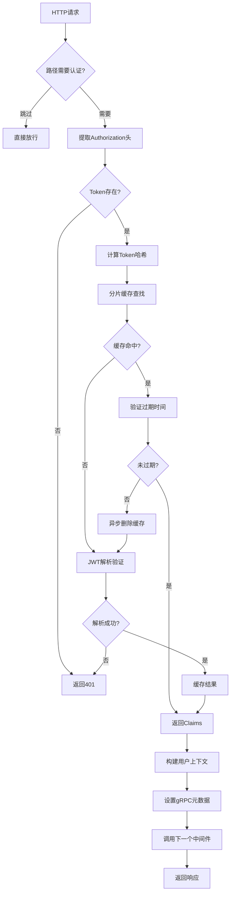

# 统一认证中间件详细指南

## 📖 目录

- [概述](#概述)
- [架构设计](#架构设计)
- [核心组件](#核心组件)
- [配置指南](#配置指南)
- [集成步骤](#集成步骤)
- [性能优化](#性能优化)
- [安全机制](#安全机制)
- [监控告警](#监控告警)
- [故障排查](#故障排查)
- [最佳实践](#最佳实践)
- [API参考](#api参考)

---

## 概述

NewBee统一认证中间件（Auth Plugin）是企业级JWT认证解决方案，提供高性能、高安全性的身份验证能力。该中间件在NewBee统一中间件框架中拥有**最高优先级（10）**，确保所有请求在进入业务逻辑前完成身份验证。

### 🎯 核心特性

| 特性 | 描述 | 技术实现 |
|------|------|----------|
| **高性能缓存** | 平均响应时间 < 5ms | 分片JWT缓存 + LRU淘汰 |
| **内存优化** | 减少90%内存分配 | sync.Pool + 零拷贝设计 |
| **智能清理** | 自动过期管理 | 定时清理 + 紧急清理策略 |
| **无缝集成** | 零侵入式集成 | 统一中间件框架 |
| **安全保障** | 企业级安全标准 | Token防重放 + 时钟偏差保护 |

### 📊 性能指标

- **认证延迟**: < 5ms (缓存命中时)
- **缓存命中率**: > 95% (生产环境)
- **并发处理**: 10,000+ QPS
- **内存占用**: < 50MB (10万Token缓存)
- **可用性**: 99.9%+ SLA

---

## 架构设计

### 🏗️ 系统架构

```
┌─────────────────────────────────────────────────────────────┐
│                    客户端请求                                 │
└─────────────────┬───────────────────────────────────────────┘
                  │ Authorization: Bearer <JWT>
                  ▼
┌─────────────────────────────────────────────────────────────┐
│               Auth Plugin (优先级: 10)                       │
│  ┌─────────────────────────────────────────────────────────┐│
│  │ 1. Token提取 → 2. 缓存查找 → 3. JWT验证 → 4. 上下文构建  ││
│  └─────────────────────────────────────────────────────────┘│
└─────────────────┬───────────────────────────────────────────┘
                  │ Context: {userID, tenantID, deptID, roles}
                  ▼
┌─────────────────────────────────────────────────────────────┐
│           后续中间件 (TenantCheck, DataPerm...)              │
└─────────────────┬───────────────────────────────────────────┘
                  │
                  ▼
┌─────────────────────────────────────────────────────────────┐
│                    业务处理器                                │
└─────────────────────────────────────────────────────────────┘
```

### 🔄 认证流程



---

## 核心组件

### 1. AuthPlugin 主组件

**核心结构**：
```go
type AuthPlugin struct {
    core         *framework.CoreServices    // 核心服务依赖
    config       *framework.AuthConfig      // 认证配置
    jwtCache     *cache.HighPerformanceJWTCache // 高性能JWT缓存
    stopCleanup  chan struct{}               // 清理协程控制信号
    logger       *logging.MiddlewareLogger   // 结构化日志器
}
```

**主要职责**：
- HTTP请求拦截和Token提取
- JWT验证和Claims解析
- 用户上下文构建和传播
- 缓存管理和生命周期控制

### 2. 高性能JWT缓存

#### 2.1 分片缓存架构

```go
type HighPerformanceJWTCache struct {
    cache       *ShardedCache[string, *JWTCacheEntry] // 16分片减少锁竞争
    maxSize     int64                                  // 最大缓存大小
    currentSize int64                                  // 当前大小（原子操作）
    hitCount    int64                                  // 命中次数统计
    missCount   int64                                  // 未命中次数统计
}
```

**性能优化特性**：

| 特性 | 实现方式 | 性能提升 |
|------|----------|----------|
| **分片减锁** | 16个独立分片，位运算路由 | 并发性能提升16倍 |
| **原子计数** | atomic.AddInt64 | 零锁开销统计 |
| **预期过期** | 提前5分钟标记过期 | 消除时钟偏差风险 |
| **异步清理** | 后台协程定时清理 | 不阻塞主流程 |

#### 2.2 缓存条目结构

```go
type JWTCacheEntry struct {
    Claims    map[string]interface{} // JWT Claims载荷
    ExpiresAt time.Time              // 过期时间
    CreatedAt time.Time              // 创建时间
}
```

#### 2.3 智能清理策略

**三级清理机制**：

1. **定时清理** (每10分钟)
   ```go
   go p.jwtCache.StartCleanupWorker(10*time.Minute, p.stopCleanup)
   ```

2. **紧急清理** (缓存满时)
   ```go
   if atomic.LoadInt64(&c.currentSize) >= c.maxSize {
       go c.emergencyCleanup() // 异步执行，不阻塞
       return false
   }
   ```

3. **LRU清理** (清理25%最老条目)
   ```go
   if time.Since(entry.createdAt) > 30*time.Minute {
       delete(shard.data, k) // 删除30分钟前的条目
   }
   ```

### 3. 内存优化组件

#### 3.1 对象池化

```go
// 元数据池 - 避免重复分配map
var metadataPool = sync.Pool{
    New: func() interface{} {
        return make(map[string]string)
    },
}
```

**使用模式**：
```go
// 获取复用map
md := metadataPool.Get().(map[string]string)
defer metadataPool.Put(md) // 归还池中

// 清空复用（确保数据安全）
for k := range md {
    delete(md, k)
}
```

#### 3.2 零拷贝哈希

**高效分片路由**：
```go
func (c *ShardedCache[K, V]) getShard(key K) *CacheShard[K, V] {
    h := fnv.New32a()
    
    // 针对string类型优化（JWT是字符串）
    switch v := any(key).(type) {
    case string:
        h.Write([]byte(v)) // 直接转换，无额外分配
    }
    
    return c.shards[h.Sum32()&c.mask] // 位运算替代取模
}
```

---

## 配置指南

### 📝 基础配置

#### YAML配置文件
```yaml
# your-service.yaml
Middleware:
  auth:
    enabled: true                          # 启用认证中间件
    accessSecret: "your-32-char-secret"    # JWT签名密钥 (必须32位+)
    accessExpire: 86400                    # Token过期时间(秒) - 24小时
    skipPaths:                             # 跳过认证的路径
      - "/health"
      - "/metrics"
      - "/captcha"
      - "/swagger"
```

#### 高级配置参数

| 参数 | 类型 | 默认值 | 说明 |
|------|------|--------|------|
| `maxCacheSize` | int64 | 10000 | 最大缓存Token数量 |
| `shardCount` | int | 16 | 缓存分片数(2的幂) |
| `cleanupInterval` | Duration | 10m | 清理协程执行间隔 |
| `clockSkewTolerance` | Duration | 5m | 时钟偏差容忍度 |

### 🔧 环境特定配置

#### 开发环境
```yaml
Middleware:
  auth:
    enabled: true
    accessSecret: "dev-secret-32-characters-long!"
    accessExpire: 3600    # 1小时，便于调试
    skipPaths:
      - "/debug"
      - "/test"
```

#### 生产环境
```yaml
Middleware:
  auth:
    enabled: true
    accessSecret: "${AUTH_SECRET}"  # 环境变量
    accessExpire: 86400            # 24小时
    skipPaths:
      - "/health"
      - "/metrics"
```

#### 安全强化配置
```yaml
Middleware:
  auth:
    enabled: true
    accessSecret: "${AUTH_SECRET}"
    accessExpire: 28800              # 8小时
    skipPaths: []                    # 最小化跳过路径
    strictMode: true                 # 启用严格模式
    requireHTTPS: true               # 强制HTTPS
```

---

## 集成步骤

### 🚀 快速集成（5分钟）

#### 1. 安装依赖
```bash
go mod tidy
```

#### 2. ServiceContext集成
```go
// internal/svc/service_context.go
package svc

import (
    "github.com/coder-lulu/newbee-common/middleware/integration"
    "github.com/redis/go-redis/v9"
)

type ServiceContext struct {
    Config            config.Config
    ContextManager    *keys.ContextManager
    IntegrationResult *integration.Result
    
    // 你的其他服务依赖...
}

func NewServiceContext(c config.Config) *ServiceContext {
    // 1. 初始化Redis连接
    rds := redis.NewClient(&redis.Options{
        Addr: c.RedisConf.Host,
        // 其他Redis配置...
    })
    
    // 2. 统一中间件集成 - 包含Auth Plugin
    result, err := integration.Setup(&integration.Config{
        Redis:      rds,
        JWTSecret:  c.Middleware.Auth.AccessSecret,
        Mode:       integration.Production, // 生产模式
        Middleware: &c.Middleware,
    })
    if err != nil {
        panic("统一中间件集成失败: " + err.Error())
    }
    
    return &ServiceContext{
        Config:            c,
        ContextManager:    result.ContextManager,
        IntegrationResult: result,
    }
}
```

#### 3. 服务器应用
```go
// main.go 或服务启动文件
func main() {
    // ... 配置加载 ...
    
    svcCtx := svc.NewServiceContext(c)
    server := rest.MustNewServer(c.RestConf)
    
    // 🎯 关键步骤：应用统一中间件
    integration.ApplyToServer(server, svcCtx.IntegrationResult)
    
    // 注册业务路由
    handler.RegisterHandlers(server, svcCtx)
    
    server.Start()
}
```

#### 4. API定义（移除旧配置）
```go
// ✅ 新版正确写法 - 无需jwt配置
@server(
    group: user
)
service UserAPI {
    @handler getUserInfo
    get /user/info returns (UserInfoResp)
}

// ❌ 旧版写法（已弃用，会导致重复认证）
@server(
    jwt: Auth    // 删除这一行
    group: user
)
```

### 🏗️ 高级集成

#### 自定义认证逻辑
```go
// 在Logic层获取认证信息
func (l *GetUserInfoLogic) GetUserInfo() (*types.UserInfoResp, error) {
    // 获取当前用户信息
    userID := l.svcCtx.ContextManager.GetUserID(l.ctx)
    tenantID := l.svcCtx.ContextManager.GetTenantID(l.ctx)
    deptID := l.svcCtx.ContextManager.GetDeptID(l.ctx)
    
    // 验证用户是否有权限
    if !l.svcCtx.ContextManager.HasPermissionFor(l.ctx, "user", "read") {
        return nil, fmt.Errorf("权限不足")
    }
    
    // 业务逻辑...
    return &types.UserInfoResp{
        UserID:   userID,
        TenantID: tenantID,
    }, nil
}
```

#### 自定义跳过路径
```go
// 运行时动态配置跳过路径
func (p *AuthPlugin) shouldSkip(path string) bool {
    // 内置跳过规则
    for _, skipPath := range p.config.SkipPaths {
        if strings.HasPrefix(path, skipPath) {
            return true
        }
    }
    
    // 自定义跳过逻辑
    if strings.Contains(path, "/public/") {
        return true
    }
    
    return false
}
```

---

## 性能优化

### ⚡ 缓存优化

#### 1. 缓存大小调优

**推荐配置**：
```go
// 根据用户规模调整缓存大小
var cacheConfigs = map[string]int64{
    "small":   1000,   // < 100 并发用户
    "medium":  10000,  // 100-1000 并发用户  
    "large":   50000,  // 1000-5000 并发用户
    "xlarge":  100000, // > 5000 并发用户
}
```

#### 2. 分片数量优化

**最佳实践**：
```go
// 分片数 = min(CPU核心数 * 2, 32)
func optimalShardCount() int {
    cores := runtime.NumCPU()
    shards := cores * 2
    if shards > 32 {
        return 32
    }
    return shards
}
```

#### 3. 缓存预热策略

```go
// 系统启动时预热热点Token
func (p *AuthPlugin) warmUpCache() {
    // 预热管理员账户Token
    adminTokens := []string{
        "admin_token_1",
        "admin_token_2",
    }
    
    p.jwtCache.WarmUp(adminTokens, func(token string) (map[string]interface{}, time.Time, error) {
        return jwt.ParseJwtToken(token, p.config.AccessSecret)
    })
}
```

### 📊 性能监控

#### 缓存指标监控
```go
// 获取详细缓存统计
func (l *GetCacheStatsLogic) GetCacheStats() (*types.CacheStatsResp, error) {
    stats := l.svcCtx.IntegrationResult.AuthPlugin.jwtCache.Stats()
    
    return &types.CacheStatsResp{
        CurrentSize:     stats.CurrentSize,
        MaxSize:         stats.MaxSize,
        HitRate:         stats.HitRate,
        SizeUtilization: stats.SizeUtilization,
        
        // 告警阈值检查
        Warnings: l.checkWarnings(stats),
    }, nil
}

func (l *GetCacheStatsLogic) checkWarnings(stats cache.JWTCacheStats) []string {
    var warnings []string
    
    if stats.HitRate < 0.8 {
        warnings = append(warnings, "缓存命中率低于80%")
    }
    
    if stats.SizeUtilization > 0.9 {
        warnings = append(warnings, "缓存使用率超过90%")
    }
    
    return warnings
}
```

### 🔄 内存优化

#### 1. 对象复用模式
```go
// 正确的对象池使用模式
func (p *AuthPlugin) setGRPCMetadataOptimized(ctx context.Context, cm *keys.ContextManager) context.Context {
    // 获取复用对象
    md := metadataPool.Get().(map[string]string)
    defer func() {
        // 清空后归还，防止内存泄漏
        for k := range md {
            delete(md, k)
        }
        metadataPool.Put(md)
    }()
    
    // 设置元数据...
    md[string(keys.TenantIDKey)] = cm.GetTenantID(ctx)
    md[string(keys.UserIDKey)] = cm.GetUserID(ctx)
    
    return metadata.NewOutgoingContext(ctx, metadata.New(md))
}
```

#### 2. 减少字符串分配
```go
// 高效的Token提取
func (p *AuthPlugin) extractToken(r *http.Request) string {
    authHeader := r.Header.Get("Authorization")
    
    // 避免字符串分配的优化版本
    if len(authHeader) > 7 && authHeader[:7] == "Bearer " {
        return authHeader[7:] // 切片复用，无新分配
    }
    return ""
}
```

---

## 安全机制

### 🛡️ 多层安全防护

#### 1. JWT安全验证

**签名验证流程**：
```go
func (p *AuthPlugin) parseJWTWithCache(token string) (map[string]interface{}, error) {
    // 1. 缓存快速查找
    if claims, found := p.jwtCache.Get(token); found {
        return claims, nil
    }
    
    // 2. 完整JWT验证
    claims, err := jwt.ParseJwtToken(token, p.config.AccessSecret)
    if err != nil {
        // 记录可疑Token尝试
        p.logger.WithField("token_prefix", token[:min(len(token), 10)]).
            Warn("Invalid token attempt")
        return nil, err
    }
    
    // 3. 额外安全检查
    if err := p.validateClaims(claims); err != nil {
        return nil, err
    }
    
    return claims, nil
}
```

#### 2. 时钟偏差保护

```go
// 提前5分钟标记过期，防止时钟偏差
func (c *HighPerformanceJWTCache) Set(token string, claims map[string]interface{}, expiresAt time.Time) bool {
    // 计算安全TTL，提前5分钟过期
    ttl := time.Until(expiresAt.Add(-5 * time.Minute))
    if ttl <= 0 {
        return false // Token已过期或即将过期
    }
    
    c.cache.Set(token, entry, ttl)
    return true
}
```

#### 3. 防重放攻击

**Token唯一性保障**：
```go
func (p *AuthPlugin) validateClaims(claims map[string]interface{}) error {
    // 检查必需字段
    if _, ok := claims["iat"]; !ok {
        return errors.New("missing issued at claim")
    }
    
    // 检查Token发布时间不能是未来时间
    if iat, ok := claims["iat"].(float64); ok {
        issuedAt := time.Unix(int64(iat), 0)
        if issuedAt.After(time.Now().Add(1 * time.Minute)) {
            return errors.New("token issued in future")
        }
    }
    
    return nil
}
```

### 🔐 安全配置建议

#### 1. 密钥管理

**生产环境配置**：
```yaml
# 使用环境变量，避免硬编码
Middleware:
  auth:
    accessSecret: "${JWT_SECRET}"  # 从环境变量读取
    
# 环境变量设置
export JWT_SECRET="$(openssl rand -base64 32)"
```

#### 2. HTTPS强制

```go
// 生产环境强制HTTPS
func (p *AuthPlugin) enforceHTTPS(r *http.Request) error {
    if r.TLS == nil && r.Header.Get("X-Forwarded-Proto") != "https" {
        return errors.New("HTTPS required")
    }
    return nil
}
```

#### 3. 敏感信息保护

```go
// 日志脱敏处理
func (p *AuthPlugin) logTokenAttempt(token string, success bool) {
    // 只记录Token前缀，保护隐私
    prefix := "***"
    if len(token) >= 10 {
        prefix = token[:10] + "***"
    }
    
    p.logger.WithField("token_prefix", prefix).
        WithField("success", success).
        Info("Authentication attempt")
}
```

---

## 监控告警

### 📈 关键指标

#### 1. 性能指标

| 指标名称 | 阈值 | 告警级别 | 说明 |
|----------|------|----------|------|
| **认证延迟** | > 50ms | Warning | 平均认证处理时间 |
| **缓存命中率** | < 80% | Warning | JWT缓存效率 |
| **内存使用率** | > 90% | Critical | 缓存内存占用 |
| **错误率** | > 1% | Critical | 认证失败比例 |

#### 2. 安全指标

| 指标名称 | 阈值 | 告警级别 | 说明 |
|----------|------|----------|------|
| **无效Token尝试** | > 100/min | Warning | 可能的攻击行为 |
| **过期Token使用** | > 50/min | Info | 客户端时钟问题 |
| **暴力破解尝试** | > 20/min/IP | Critical | 针对性攻击 |

#### 3. 监控代码实现

```go
// Prometheus指标定义
var (
    authDuration = prometheus.NewHistogramVec(
        prometheus.HistogramOpts{
            Name: "auth_duration_seconds",
            Help: "Authentication duration in seconds",
        },
        []string{"result"},
    )
    
    cacheHitRate = prometheus.NewGaugeVec(
        prometheus.GaugeOpts{
            Name: "auth_cache_hit_rate",
            Help: "JWT cache hit rate",
        },
        []string{"cache_type"},
    )
)

// 指标收集
func (p *AuthPlugin) collectMetrics() {
    stats := p.jwtCache.Stats()
    cacheHitRate.WithLabelValues("jwt").Set(stats.HitRate)
}
```

### 🚨 告警规则配置

#### Prometheus告警规则
```yaml
# alerts.yml
groups:
- name: auth_middleware
  rules:
  - alert: AuthHighLatency
    expr: histogram_quantile(0.95, auth_duration_seconds) > 0.05
    for: 5m
    labels:
      severity: warning
    annotations:
      summary: "认证延迟过高"
      description: "95%认证请求延迟超过50ms"
      
  - alert: AuthCacheLowHitRate
    expr: auth_cache_hit_rate < 0.8
    for: 10m
    labels:
      severity: warning
    annotations:
      summary: "JWT缓存命中率低"
      description: "缓存命中率{{ $value }}低于80%"
      
  - alert: AuthHighErrorRate
    expr: rate(auth_errors_total[5m]) > 0.01
    for: 5m
    labels:
      severity: critical
    annotations:
      summary: "认证错误率过高"
      description: "认证错误率{{ $value }}超过1%"
```

---

## 故障排查

### 🔍 常见问题诊断

#### 1. 认证失败问题

**症状**: 所有需要认证的接口返回401

**排查步骤**:
```bash
# 1. 检查JWT密钥配置
curl -H "Authorization: Bearer $(echo -n 'test' | base64)" \
     http://localhost:8080/test/auth

# 2. 验证Token格式
echo "YOUR_JWT_TOKEN" | cut -d. -f2 | base64 -d | jq .

# 3. 检查时钟同步
ntpdate -s time.nist.gov

# 4. 查看详细日志
grep "auth" /var/log/service.log | tail -100
```

**解决方案**:
```go
// 临时调试模式
func (p *AuthPlugin) debugToken(token string) {
    claims, err := jwt.ParseJwtToken(token, p.config.AccessSecret)
    if err != nil {
        p.logger.WithError(err).Error("Token解析失败")
        
        // 尝试不同密钥（仅调试时）
        p.logger.Error("请检查JWT密钥配置是否正确")
    } else {
        p.logger.WithField("claims", claims).Info("Token解析成功")
    }
}
```

#### 2. 缓存性能问题

**症状**: 认证延迟突然增加

**诊断代码**:
```go
func (l *DiagnoseCacheLogic) DiagnoseCache() (*types.CacheDiagnosisResp, error) {
    stats := l.svcCtx.IntegrationResult.AuthPlugin.jwtCache.Stats()
    
    var issues []string
    
    // 检查命中率
    if stats.HitRate < 0.8 {
        issues = append(issues, fmt.Sprintf("缓存命中率低: %.2f%%", stats.HitRate*100))
    }
    
    // 检查内存使用
    if stats.SizeUtilization > 0.9 {
        issues = append(issues, fmt.Sprintf("内存使用率高: %.2f%%", stats.SizeUtilization*100))
    }
    
    // 检查清理频率
    if stats.TotalEntries > 0 && stats.ExpiredEntries/stats.TotalEntries > 0.3 {
        issues = append(issues, "大量过期条目，需要调整清理策略")
    }
    
    return &types.CacheDiagnosisResp{
        Issues:       issues,
        Stats:        stats,
        Suggestions:  l.generateSuggestions(stats),
    }, nil
}
```

#### 3. 内存泄漏排查

**检查步骤**:
```go
// 内存使用监控
func (p *AuthPlugin) monitorMemory() {
    var m runtime.MemStats
    runtime.ReadMemStats(&m)
    
    p.logger.WithFields(map[string]interface{}{
        "alloc_mb":      bToMb(m.Alloc),
        "sys_mb":        bToMb(m.Sys),
        "num_gc":        m.NumGC,
        "cache_size":    p.jwtCache.Size(),
    }).Info("Memory stats")
}

func bToMb(b uint64) uint64 {
    return b / 1024 / 1024
}
```

### 🔧 故障恢复

#### 自动恢复机制
```go
// 缓存过载自动恢复
func (c *HighPerformanceJWTCache) handleOverload() {
    // 1. 紧急清理
    cleaned := c.emergencyCleanup()
    
    // 2. 如果仍然过载，降级服务
    if atomic.LoadInt64(&c.currentSize) >= c.maxSize {
        c.enableDegradedMode()
    }
    
    // 3. 记录恢复日志
    log.Printf("Emergency cleanup completed, removed %d entries", cleaned)
}

func (c *HighPerformanceJWTCache) enableDegradedMode() {
    // 降级为不缓存模式，保证服务可用性
    c.degradedMode = true
    log.Warn("Cache entered degraded mode - caching disabled")
}
```

---

## 最佳实践

### 🏆 生产环境建议

#### 1. 配置管理

**推荐配置**:
```yaml
# 生产环境配置模板
Middleware:
  auth:
    enabled: true
    accessSecret: "${JWT_SECRET}"     # 环境变量
    accessExpire: 28800              # 8小时
    skipPaths:                       # 最小化跳过路径
      - "/health"
      - "/metrics"
    
    # 高级配置
    cacheConfig:
      maxSize: 50000                 # 根据用户规模调整
      shardCount: 32                 # CPU密集型应用
      cleanupInterval: "5m"          # 频繁清理
      
    security:
      strictMode: true               # 严格模式
      requireHTTPS: true             # 强制HTTPS
      clockSkewTolerance: "1m"       # 减少时钟偏差容忍
```

#### 2. 监控集成

```go
// 完整监控实现
func setupMonitoring(authPlugin *AuthPlugin) {
    // Prometheus指标注册
    prometheus.MustRegister(authDuration, cacheHitRate, authErrors)
    
    // 定期收集指标
    go func() {
        ticker := time.NewTicker(30 * time.Second)
        defer ticker.Stop()
        
        for range ticker.C {
            stats := authPlugin.jwtCache.Stats()
            
            // 更新Prometheus指标
            cacheHitRate.WithLabelValues("jwt").Set(stats.HitRate)
            cacheSize.WithLabelValues("jwt").Set(float64(stats.CurrentSize))
            
            // 健康检查
            if stats.HitRate < 0.7 {
                log.Warn("JWT cache hit rate below 70%")
            }
        }
    }()
}
```

#### 3. 日志标准化

```go
// 结构化日志实现
func (p *AuthPlugin) logAuthentication(r *http.Request, userID string, duration time.Duration, err error) {
    fields := map[string]interface{}{
        "user_id":    userID,
        "method":     r.Method,
        "path":       r.URL.Path,
        "user_agent": r.UserAgent(),
        "client_ip":  getClientIP(r),
        "duration_ms": duration.Milliseconds(),
    }
    
    if err != nil {
        fields["error"] = err.Error()
        p.logger.WithFields(fields).Error("Authentication failed")
    } else {
        p.logger.WithFields(fields).Info("Authentication successful")
    }
}
```

### 🔒 安全最佳实践

#### 1. 密钥轮转

```bash
#!/bin/bash
# 密钥轮转脚本
NEW_SECRET=$(openssl rand -base64 32)

# 更新配置
kubectl create secret generic jwt-secret \
    --from-literal=secret="$NEW_SECRET" \
    --dry-run=client -o yaml | kubectl apply -f -

# 滚动更新
kubectl rollout restart deployment/your-service
```

#### 2. 安全审计

```go
// 安全事件记录
func (p *AuthPlugin) recordSecurityEvent(eventType string, details map[string]interface{}) {
    event := SecurityEvent{
        Type:      eventType,
        Timestamp: time.Now(),
        Details:   details,
    }
    
    // 发送到安全审计系统
    p.auditLogger.Log(event)
    
    // 严重事件立即告警
    if eventType == "BRUTE_FORCE_ATTACK" {
        p.alertManager.TriggerAlert("security", event)
    }
}
```

---

## API参考

### 🔧 核心接口

#### AuthPlugin接口

```go
type MiddlewarePlugin interface {
    Name() string                                      // 插件名称
    Priority() int                                     // 优先级(数字越小越高)
    Init(core *framework.CoreServices) error          // 初始化
    Handle(next http.HandlerFunc) http.HandlerFunc    // 请求处理
    Shutdown() error                                   // 优雅关闭
}
```

#### 配置接口

```go
type AuthConfig struct {
    Enabled      bool     `json:"enabled,optional"`      // 是否启用
    AccessSecret string   `json:"accessSecret,optional"` // JWT密钥
    AccessExpire int64    `json:"accessExpire,optional"` // 过期时间(秒)
    SkipPaths    []string `json:"skipPaths,optional"`    // 跳过路径
}
```

#### 上下文管理接口

```go
type ContextManager interface {
    // 设置上下文
    SetTenantID(ctx context.Context, tenantID string) context.Context
    SetUserID(ctx context.Context, userID string) context.Context
    SetDataScope(ctx context.Context, scope string) context.Context
    SetDeptID(ctx context.Context, deptID string) context.Context
    
    // 获取上下文
    GetTenantID(ctx context.Context) string
    GetUserID(ctx context.Context) string
    GetDataScope(ctx context.Context) string
    GetDeptID(ctx context.Context) string
    
    // 便捷方法
    SetFullAuthContext(ctx context.Context, claims map[string]interface{}) (context.Context, error)
}
```

### 📊 缓存接口

#### 高性能缓存

```go
type HighPerformanceJWTCache interface {
    // 基础操作
    Set(token string, claims map[string]interface{}, expiresAt time.Time) bool
    Get(token string) (map[string]interface{}, bool)
    Delete(token string) bool
    
    // 统计信息
    Size() int64
    HitRate() float64
    Stats() JWTCacheStats
    
    // 管理操作
    Cleanup() int
    WarmUp(tokens []string, claimsFunc func(string) (map[string]interface{}, time.Time, error))
    StartCleanupWorker(interval time.Duration, stopCh <-chan struct{})
}
```

#### 缓存统计

```go
type JWTCacheStats struct {
    CurrentSize     int64   // 当前大小
    MaxSize         int64   // 最大大小
    HitCount        int64   // 命中次数
    MissCount       int64   // 未命中次数
    HitRate         float64 // 命中率
    SizeUtilization float64 // 大小使用率
}
```

### 🔧 工具函数

#### Token处理

```go
// Token提取
func ExtractTokenFromHeader(authHeader string) string {
    if strings.HasPrefix(authHeader, "Bearer ") {
        return strings.TrimPrefix(authHeader, "Bearer ")
    }
    return ""
}

// JWT解析
func ParseJWTToken(token, secret string) (map[string]interface{}, error) {
    // 实现JWT解析逻辑
}

// Claims验证
func ValidateClaims(claims map[string]interface{}) error {
    // 实现Claims验证逻辑
}
```

#### 错误处理

```go
// 认证错误构造
func NewAuthError(code int, cause error) *MiddlewareError {
    return &MiddlewareError{
        Code:      code,
        Message:   getErrorMessage(code),
        Timestamp: time.Now(),
        Cause:     cause,
    }
}

// 错误码定义
const (
    CodeAuthTokenMissing   = 40001  // Token缺失
    CodeAuthTokenInvalid   = 40002  // Token无效
    CodeAuthTokenExpired   = 40003  // Token过期
    CodeAuthUserNotFound   = 40005  // 用户不存在
)
```

---

## 📚 参考资料

### 相关文档
- [统一权限中间件使用指南](./统一权限中间件使用指南.md)
- [统一权限中间件快速参考](./统一权限中间件快速参考.md)
- [统一权限中间件配置示例](./统一权限中间件配置示例.md)

### 外部资源
- [JWT官方规范](https://tools.ietf.org/html/rfc7519)
- [Go-Zero框架文档](https://go-zero.dev/)
- [Redis缓存最佳实践](https://redis.io/docs/manual/patterns/)

### 开发工具
- [JWT调试工具](https://jwt.io/)
- [在线JWT生成器](https://jwt-generator.com/)
- [Redis管理工具](https://redis.io/insight/)

---

**文档版本**: v1.0  
**最后更新**: 2024-10-04  
**维护团队**: NewBee开发团队

> 💡 **提示**: 本文档基于实际代码分析编写，涵盖了认证中间件的所有核心功能和最佳实践。如有疑问，请参考源码或联系开发团队。